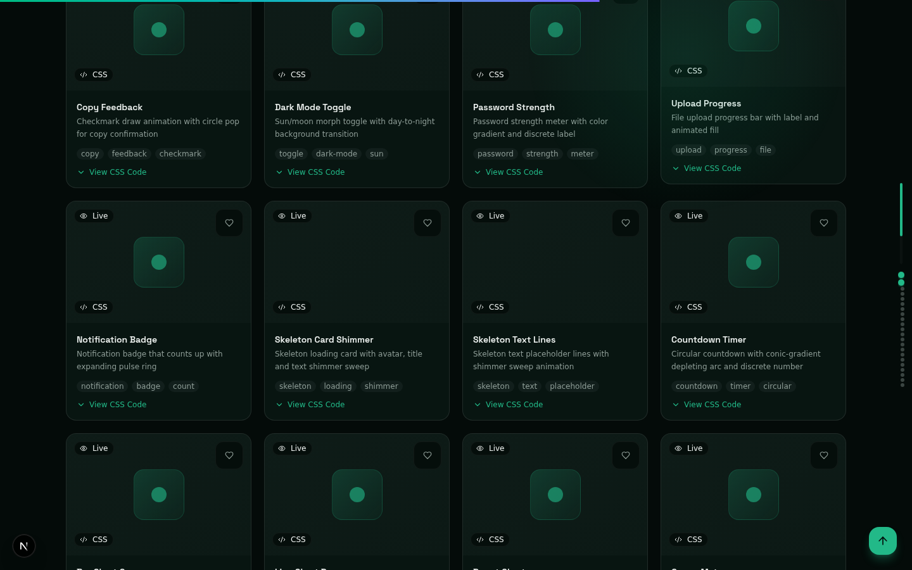
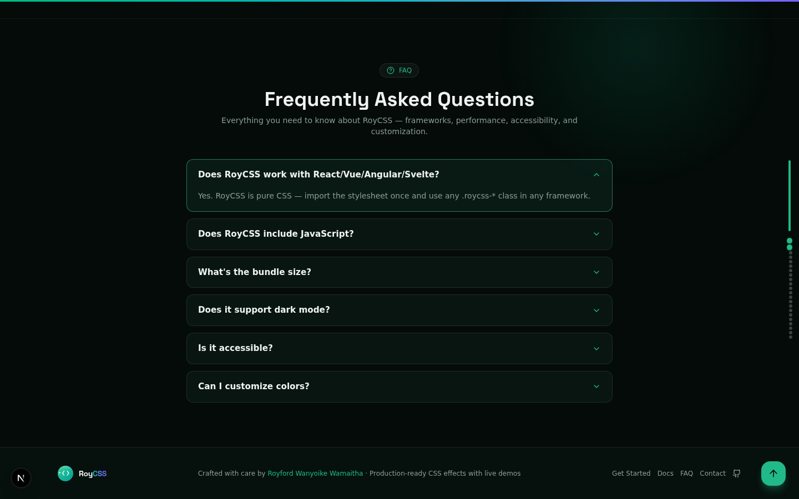

<div align="center">

# RoyCSS

### AI-Native Frontend Engineering Platform

**1,959 production-ready CSS effects · 62 platform products · 68 developer tools · AI-native**

[](https://roycss.vercel.app)
[](#key-numbers)
[](#key-numbers)
[](#key-numbers)
[](#key-numbers)
[](#engineering-practices)
[](#engineering-practices)
[](LICENSE)
[](#quick-start)

**Live demo: <https://roycss.vercel.app>**

<sub><b>Status:</b> the live site currently serves a build from before the latest wave of fixes — the production redeploy is pending an owner-side account/billing action ([#75](https://github.com/Roy-Wanyoike/Roycss/issues/75)). Everything merged to `main` is verified locally: build ✓ · `tsc` 0 errors · 141/141 tests ✓.</sub>

</div>

---

<div align="center">


*The RoyCSS platform — 1,959 effects, 62 platform products, live previews, AI assistance.*

</div>

---

## What is RoyCSS?

RoyCSS is a **complete frontend engineering platform** — not just a CSS effects library:

- **1,959 production-ready CSS effects** across 29 categories with live previews and copyable code
- **62 platform products** (RoyAI, Roy Studio, Roy Inspector, Roy Cloud, Marketplace, Academy, …)
- **68 developer tools** (CSS generators, visualizers, analyzers, converters)
- **AI-native development** (RoyAI assistant, LLM-backed modules for architect, designer, mentor, pair, review)
- **Design system** (OKLCH color tokens, theme presets, motion library)
- **Accessibility-first** (WCAG AA target, keyboard navigation, screen reader support, reduced-motion)
- **Framework-agnostic output** (copy as CSS, inline styles, Tailwind, SCSS, CSS-in-JS, Vue, HTML)
- **PWA-installable** (service worker v2.1.0, offline support, install prompt)

---

## Screenshots

<div align="center">

| | |
|---|---|
|  |  |
| **Homepage** | **Effects gallery (1,959 effects)** |
|  |  |
| **Featured effects carousel** | **Effect detail dialog** |
|  |  |
| **Platform ecosystem (62 products)** | **Platform pillars** |
|  |  |
| **Getting-started guide** | **FAQ** |
|  |  |
| **Mobile responsive** | **Mobile navigation** |
|  |  |
| **Color customizer** | **Contact form** |
|  |  |
| **CTA banner** | **Footer** |

</div>

---

## Key numbers

Every number below is verified — most are pinned by tests, so stale docs fail CI, not recruiters.

| Metric | Value | Pinned where |
|---|---|---|
| CSS effects | **1,959** | `src/lib/roycss-effects.ts` — asserted by [`tests/unit/effects.test.ts`](tests/unit/effects.test.ts) |
| Effect categories | **29** | asserted by [`tests/unit/categories.test.ts`](tests/unit/categories.test.ts), rendered live on the homepage |
| Platform products | **62** | `src/lib/product-registry.ts` (`PRODUCT_COUNT`) |
| Backend modules | **68** | `backend-node/src/modules/`, mounted in `backend-node/src/server/app.ts` |
| Backend API routes | **258** | documented in [`API.md`](API.md), enforced by the drift gate (`bun run api:check`) |
| SEO effect pages | **1,959** | statically prerendered at `/effects/<id>` — one page per effect, all in the sitemap |
| Tests | **141** | 111 frontend unit (Vitest) + 30 backend integration (supertest) — all passing |
| Typecheck | **0 errors** | `bunx tsc --noEmit` on strict TypeScript |

---

## Tech stack

| Layer | Stack |
|---|---|
| **Frontend** | [Next.js 16](https://nextjs.org) (App Router, Turbopack) · React 19 · TypeScript 5 (strict) · Tailwind CSS 4 · shadcn/ui |
| **Backend** | Node: Express 4 + Prisma 6 + Zod 4 (68 modules, 258 routes) — the running source of truth · Go 1.23 (`chi`) port in progress for production |
| **Runtime** | Bun (install + scripts, `>=1.0`) — Node `>=18.18` compatible (`.nvmrc`: 20) |
| **Data** | SQLite (dev) → PostgreSQL-ready (Supabase in the prod blueprints) · 46 Prisma models |
| **Quality** | Vitest (141 tests) · Playwright E2E + axe-core a11y audits · `tsc` strict-clean · API drift gate |
| **Deploy** | Vercel ([`vercel.json`](vercel.json)) + Render blueprint ([`render.yaml`](render.yaml)) |
| **Ecosystem** | npm package artifacts ([`dist/`](dist)) · RoyCLI · MCP server · VS Code extension |
| **Realtime** | Socket.io (Roy Live, port 3003) |
| **PWA** | Service worker v2.1.0 + manifest, install prompt, offline support |

---

## Quick start

Prerequisites: [Bun](https://bun.sh) `>=1.0` (the primary runtime — Node `>=18.18` is also declared in `engines`, `.nvmrc` pins Node 20).

```bash
git clone https://github.com/Roy-Wanyoike/Roycss.git
cd Roycss
bun install        # postinstall runs `prisma generate`
bun run dev        # → http://localhost:3000
```

That's the whole frontend setup — **no `.env`, no database required**. The full 1,959-effect catalog ships in-repo (`src/lib/`), so the site works standalone.

**Optional: the backend API** (`http://localhost:4000`, 68 modules — the frontend proxies `/api/v1/*` to it automatically):

```bash
cd backend-node
bun install
DATABASE_URL="file:./dev.db" bunx prisma db push   # create the SQLite tables (46 models)
DATABASE_URL="file:./dev.db" \
JWT_SECRET="dev-jwt-secret-16-chars" \
JWT_REFRESH_SECRET="dev-jwt-refresh-16-chars" \
bun run dev
```

The inline `JWT_SECRET` / `JWT_REFRESH_SECRET` values aren't ceremony: the backend validates its environment with Zod at boot and **exits fast** if any variable is missing or under 16 characters. See [`backend-node/.env.example`](backend-node/.env.example) for the full variable list.

### Handy commands

| Command | What it does |
|---|---|
| `bun run dev` | Frontend dev server (port 3000) |
| `bun run lint` | ESLint |
| `bun run build` | Production build (`prisma generate` + `next build`) |
| `bun run build:package` | Rebuild the npm artifacts in `dist/` |
| `bunx vitest run` | 111 frontend unit tests |
| `bunx tsc --noEmit` | Typecheck gate (0 errors) |
| `cd backend-node && bun run test:integration` | 30 backend integration tests |
| `cd backend-node && bun run api:check` | API docs drift gate (code vs `API.md`) |
| `cd backend-node && bun run typecheck` | Backend typecheck gate |

---

## Repo map

```
Roycss/
├── src/                    # Next.js 16 frontend — routes, 100+ components, effects catalog in lib/
│   ├── app/                #   Pages + API routes (catch-all /api/v1 proxy, auth, health, og)
│   ├── components/roycss/  #   pro/ (62 platform products) · tools/ (68 dev tools) · effects/ (9 WebGL) · auth/
│   └── lib/                #   The 1,959-effect catalog, product registry, design tokens, API client
├── backend-node/           # Express + Prisma + Zod API — 68 modules, 258 routes (source of truth today)
├── backend-go/             # Go 1.23 + chi port of the same /api/v1 contract (production target, in progress)
├── mcp-server/             # MCP server — effects, patterns & tokens for AI assistants (Claude, Cursor, …)
├── cli/                    # RoyCLI — search and copy effects from the terminal
├── vscode-extension/       # VS Code extension — snippets, completions, hover docs, effect search
├── mini-services/          # Roy Live — Socket.io realtime service (port 3003)
├── docs/                   # CONTRIBUTING.md, screenshots/, architecture notes
├── docs/PENDING-FEATURES.md  # Roadmap — 47 pending items, priority-tagged
├── API.md                  # Full public API reference — 258 backend routes, drift-gate-checked
├── dist/                   # npm package artifacts — roycss.css, effects.json, ESM/CJS builds
├── tests/                  # Unit (Vitest) · E2E (Playwright) · a11y (axe) · load (k6) · i18n
├── a11y/ security/ perf/   # Audit harnesses — WCAG, CSP/XSS/SBOM, benchmarks
├── prisma/                 # Root schema (frontend build) — backend schema lives in backend-node/
├── scripts/                # Build, release, validation scripts
├── .github/                # CI (lint · typecheck · unit + integration tests · package build), deploy + release workflows, Dependabot
├── vercel.json             # Frontend deploy (Vercel)
└── render.yaml             # Backend deploy (Render blueprint)
```

### Dual-backend architecture

```
Frontend (Next.js 16, Vercel)
    ↕  REST via same-origin catch-all proxy (/api/v1/*)
Backend-node (Express + Prisma, Render)  ⇄  Backend-go (Go, Cloud Run — production target)
    ↕  Database (SQLite dev → Supabase Postgres prod)
Live Service (Socket.io, port 3003)
```

`backend-node` is the running source of truth (all 68 modules live today). `backend-go` registers the same `/api/v1` route surface; modules not yet ported return `501` so clients fall back to `backend-node`. The port plan is batched in [`docs/PENDING-FEATURES.md`](docs/PENDING-FEATURES.md) (PF-008).

---

## Engineering practices

Recruiters: every claim here is reproducible from this repo.

- **141 tests, all green** — 111 frontend unit (Vitest) + 30 backend integration (supertest against the booted Express app). The catalog size itself is test-pinned: `tests/unit/effects.test.ts` asserts *exactly 1,959 effects*, `tests/unit/categories.test.ts` asserts *exactly 29 categories* — stale docs fail CI, not users.
- **Typecheck gate** — `bunx tsc --noEmit` passes with **0 errors** on strict TypeScript across the frontend; the backend has its own `bun run typecheck` gate.
- **Security headers + a static-safe CSP** — every production response carries a Content-Security-Policy that is **identical for prerendered and dynamic pages**, plus `X-Content-Type-Options`, `Referrer-Policy` and `Permissions-Policy`. The CSP was rewritten after a nonce/`strict-dynamic` policy silently broke every script on the statically prerendered site ([#54](https://github.com/Roy-Wanyoike/Roycss/issues/54)) — postmortem-style comments in [`src/proxy.ts`](src/proxy.ts) explain why nonces are permanently banned there.
- **Auth-enforced API** — all 37 mutating endpoints across 27 modules require Bearer JWT; unauthenticated calls get a consistent `401` envelope, role-gated actions get `403` (PR [#76](https://github.com/Roy-Wanyoike/Roycss/pull/76), fixes #64). Verified end-to-end by 10 dedicated integration tests.
- **Accessibility** — WCAG AA is the target: automated axe-core audit reports **0 violations across 88 applicable rules**, `prefers-reduced-motion` is honored app-wide, and keyboard navigation is audited — see [`tests/a11y/WCAG-REPORT.md`](tests/a11y/WCAG-REPORT.md) and the [`a11y/`](a11y) harness.
- **API docs with a drift gate** — [`API.md`](API.md) documents all 258 backend routes + 14 frontend routes; `bun run api:check` statically walks `app.ts` + module routers and **fails if code and docs disagree** in either direction.
- **SEO done properly** — each of the 1,959 effects has a statically prerendered page at `/effects/<id>` with JSON-LD, OG tags and prev/next links (PR [#77](https://github.com/Roy-Wanyoike/Roycss/pull/77)); unknown IDs return **hard 404s** (no soft-fail blank pages), and every URL is in the sitemap.
- **Fail-fast backend** — environment is validated with Zod at boot (`process.exit(1)` with a readable error list instead of a mystery crash mid-request).
- **Security posture in-repo** — CSP/XSS/SBOM scans and a vulnerability reporting policy live in [`security/`](security) (see [`security/SECURITY-POLICY.md`](security/SECURITY-POLICY.md)).
- **Operational honesty** — the production deploy path is tracked publicly in [#75](https://github.com/Roy-Wanyoike/Roycss/issues/75): what's merged, what's verified, and exactly which owner-side action unblocks the redeploy.

---

## Effect categories

Top categories by count (all 29 are rendered live on the homepage):

| Category | Effects | Examples |
|---|---|---|
| Animations | 322 | Pulse glow, bounce in, fade in up |
| Visual Effects | 278 | Border beam, aurora border, inner glow |
| Backgrounds | 160 | Animated gradient, dot grid, mesh gradient |
| Hover Effects | 120 | Scale up, underline slide, glow border |
| Text Effects | 111 | Gradient text, neon glow, text stroke |
| Microinteractions | 107 | Toggle switch, checkbox check, radio select |
| Glass UI | 80 | Frosted glass, acrylic glass, liquid glass |
| Scroll | 71 | Scroll reveal up/left/right |
| Loaders | 66 | Ring spinner, bouncing dots, equalizer bars |
| Cards | 56 | Glassmorphism, neon card, spotlight card |
| Buttons | 55 | Shine sweep, fill slide, ripple click |
| Particles | 52 | Particle fields and network effects |
| + 17 more categories | … | forms, cursor, page-transitions, borders, 3d-transforms, navigation, filters, physics, liquid, morphing, retro, data-viz, status-state, audio, immersive, advanced-text, misc |

---

## Deployment

**Frontend → Vercel.** Import the repo on [vercel.com](https://vercel.com) — Next.js is auto-detected, [`vercel.json`](vercel.json) applies. Set `BACKEND_URL` (your backend URL) and optionally `LIVE_URL` (WebSocket service). A same-origin catch-all proxy (`src/app/api/v1/[...path]/route.ts`) forwards all `/api/v1/*` traffic to the backend.

**Backend → Render.** New → Blueprint → select this repo; [`render.yaml`](render.yaml) (with `rootDir: backend-node`) provisions the service. Required secrets: `DATABASE_URL` (Postgres), `JWT_SECRET`, `JWT_REFRESH_SECRET` — everything else has safe defaults or mock fallbacks (see [`backend-node/.env.example`](backend-node/.env.example)).

One repo, two deploys: the frontend deploys from the root, the backend from the `backend-node/` subdirectory — no repo splitting needed. Production target for the backend is the Go port (Cloud Run + Postgres + Redis).

> **Note:** the current production deploy at [roycss.vercel.app](https://roycss.vercel.app) predates the latest merged fixes — the redeploy is pending an owner-side action, tracked in [#75](https://github.com/Roy-Wanyoike/Roycss/issues/75).

---

## Contribute

Issues and PRs are welcome! Start with [`docs/CONTRIBUTING.md`](docs/CONTRIBUTING.md) — it covers the dev workflow, commands, and the contribution checklist (WCAG AA compliance included). The live backlog of planned work is [`docs/PENDING-FEATURES.md`](docs/PENDING-FEATURES.md) (47 items, priority-tagged, ready for per-item dispatch).

## Contact

**Built by [Royford Wanyoike Wamaitha](https://github.com/Roy-Wanyoike)** ([@Roy-Wanyoike](https://github.com/Roy-Wanyoike) · [roywanyoike328@gmail.com](mailto:roywanyoike328@gmail.com))

- Found a bug or want a feature? [Open an issue](https://github.com/Roy-Wanyoike/Roycss/issues)
- Security reports: [`security/SECURITY-POLICY.md`](security/SECURITY-POLICY.md)
- Sponsor the project: **[github.com/sponsors/Roy-Wanyoike](https://github.com/sponsors/Roy-Wanyoike)**

## License

MIT — see [`LICENSE`](LICENSE).
