<div align="center">

# RoyCSS

### AI-Native Frontend Engineering Platform

**1,749 CSS effects · 62 platform products · 68 developer tools · AI assistance**

A modern, AI-native frontend engineering platform — design, build, customize, and ship modern interfaces in one cohesive ecosystem.

[](#)
[](#)
[](#)
[](#)
[](#)

</div>

---

<div align="center">

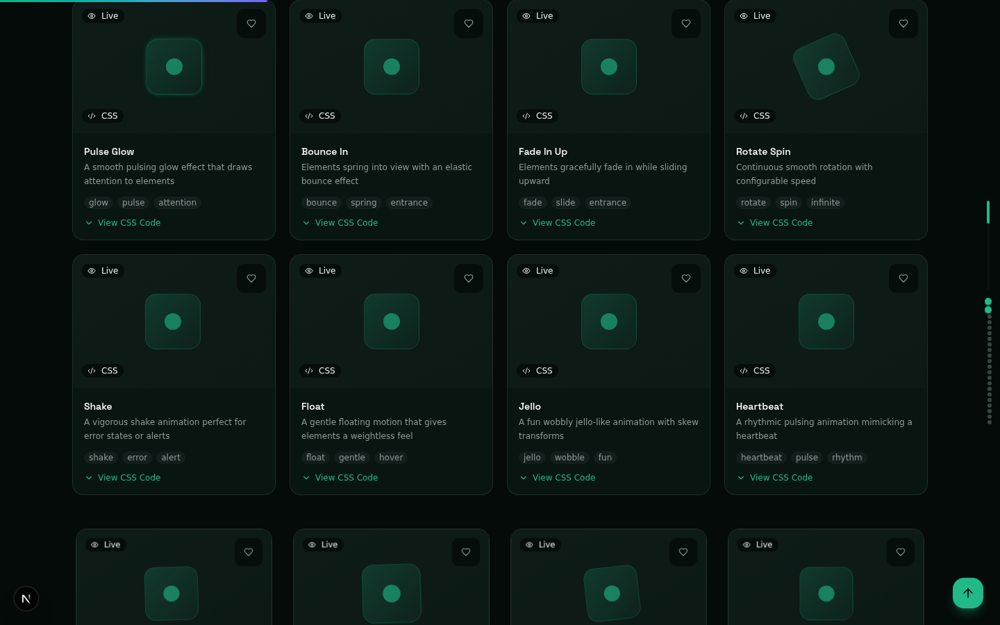

*The RoyCSS landing page — 1,749 effects, 62 platform products, live previews, AI assistance.*

</div>

---

## Overview

RoyCSS is not just a CSS effects library — it's a **complete frontend engineering platform** combining:

- **1,749 CSS effects** across 29 categories with live previews, copyable code, zero JS runtime
- **62 platform products** (RoyAI, Roy Studio, Roy Inspector, Roy Cloud, Marketplace, Academy, etc.)
- **68 developer tools** (CSS generators, visualizers, analyzers, converters)
- **AI-native development** (RoyAI assistant, LLM-backed modules for architect, designer, mentor, pair, review)
- **Design system** (OKLCH color tokens, 10 theme presets, motion library)
- **Accessibility-first** (WCAG 2.2 AA, keyboard navigation, screen reader support)
- **Framework-agnostic** (React, Vue, Angular, Svelte — copy as CSS, inline, Tailwind, SCSS, CSS-in-JS, Vue, HTML)
- **PWA-installable** (offline support, service worker, install prompt)

---

## Screenshots

<div align="center">

| | |
|---|---|
|  | 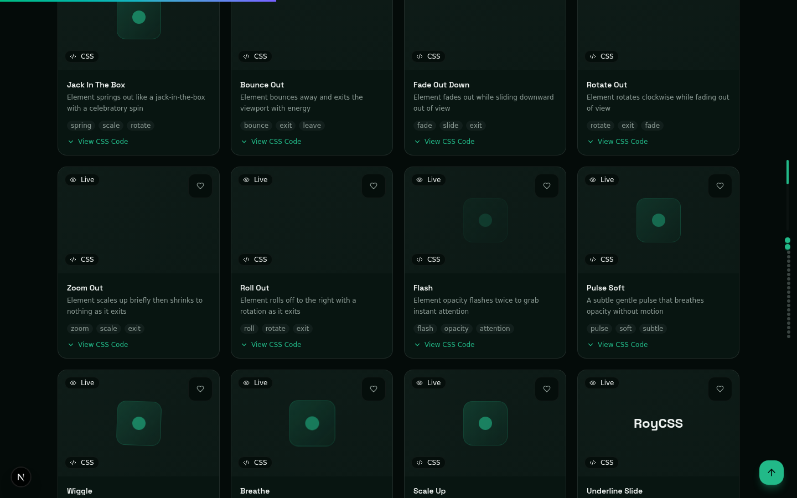 |
| **Hero Section** | **Effects Gallery** |
| 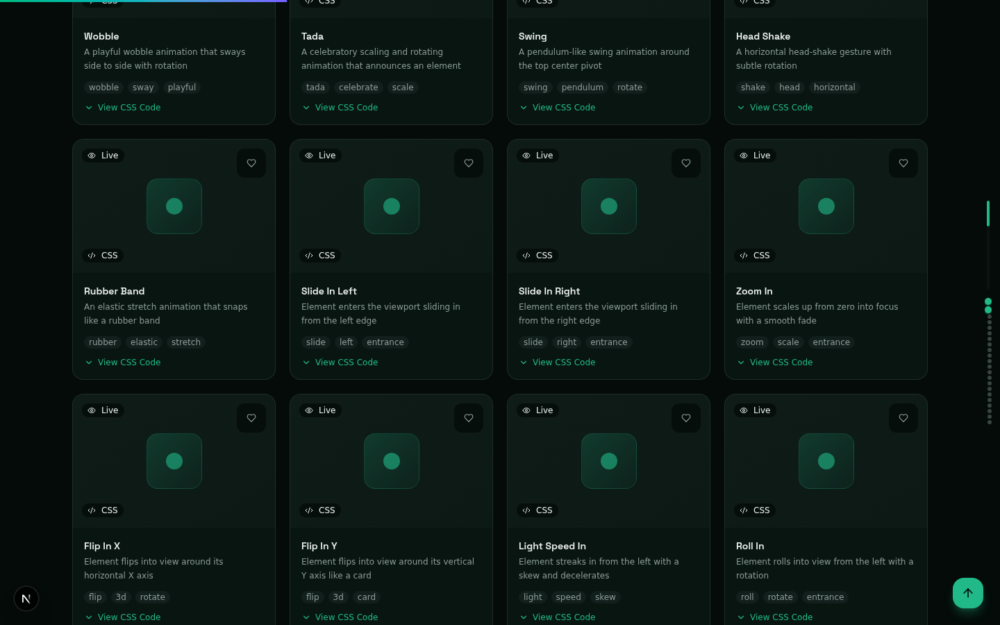 | 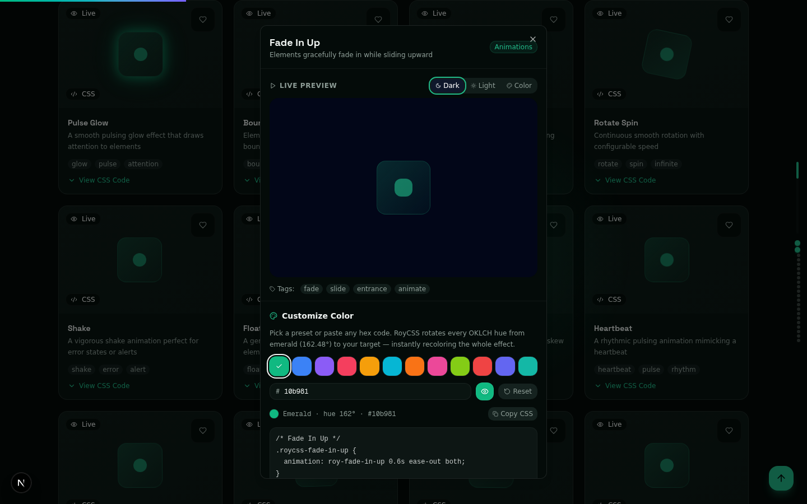 |
| **Featured Effects Carousel** | **Effect Detail Dialog** |
| 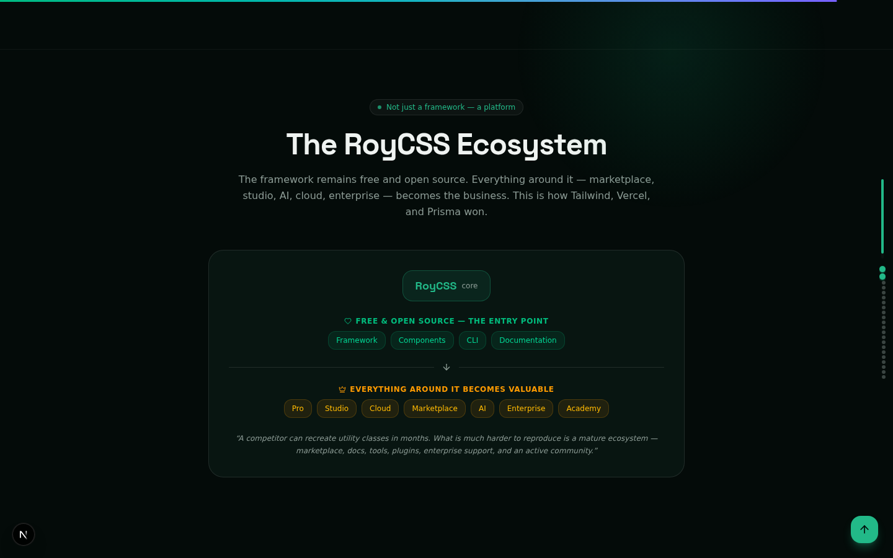 | 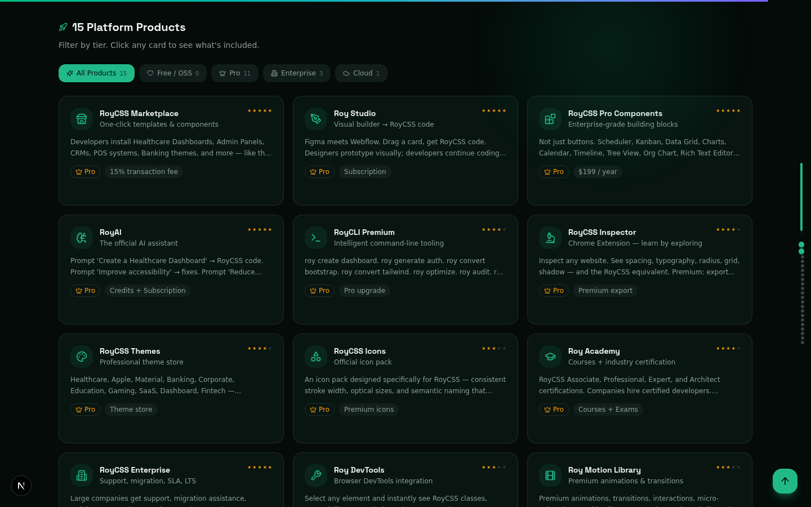 |
| **Platform Ecosystem** | **Platform Differentiators** |
| 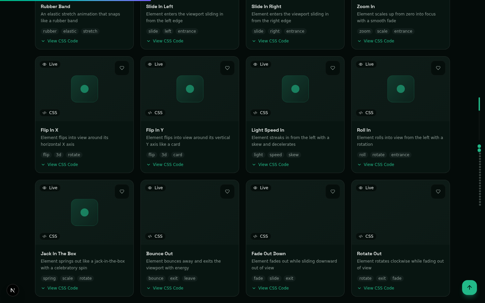 | 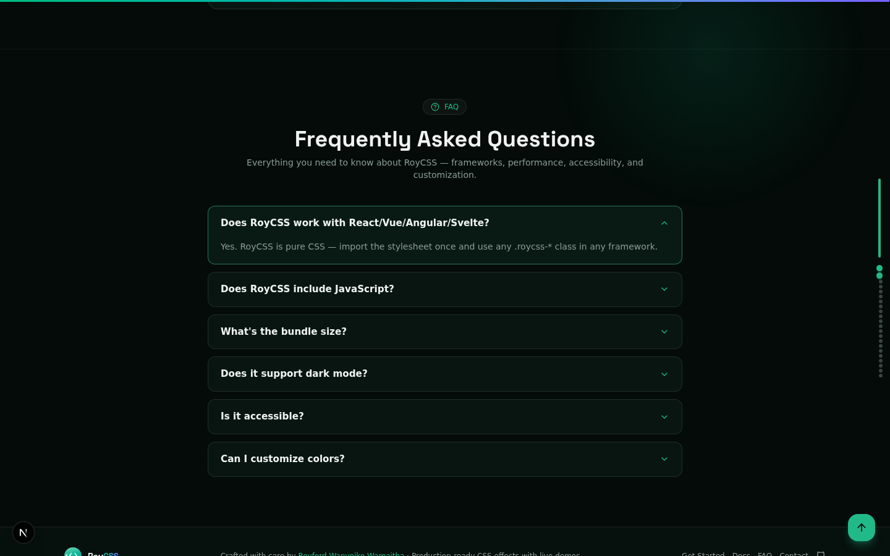 |
| **Get Started Guide** | **FAQ Section** |
| 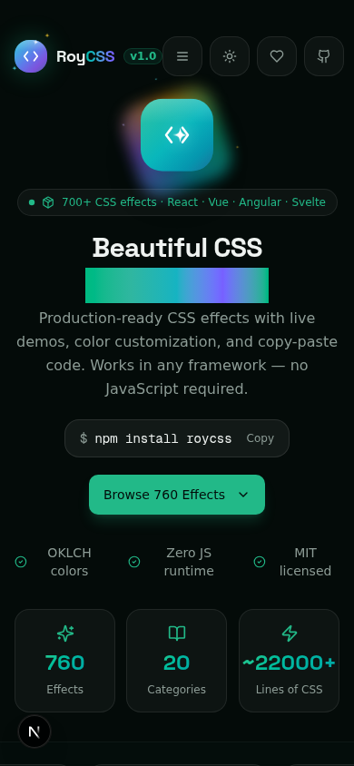 | 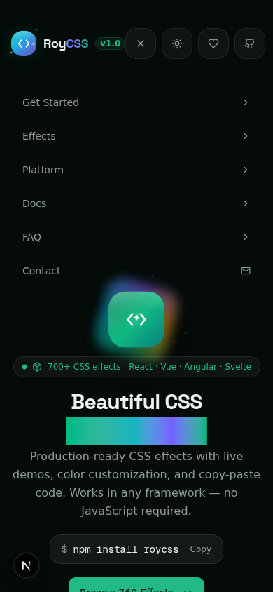 |
| **Mobile Hero** | **Mobile Navigation** |
| 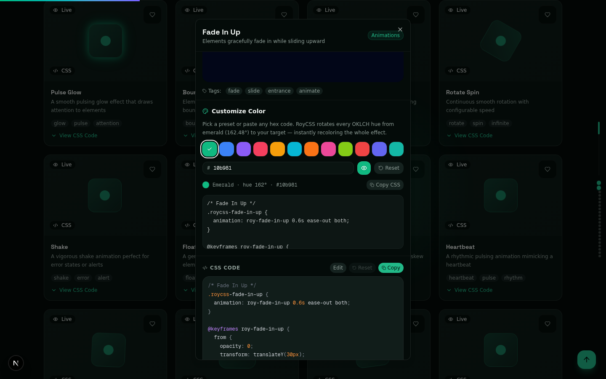 | 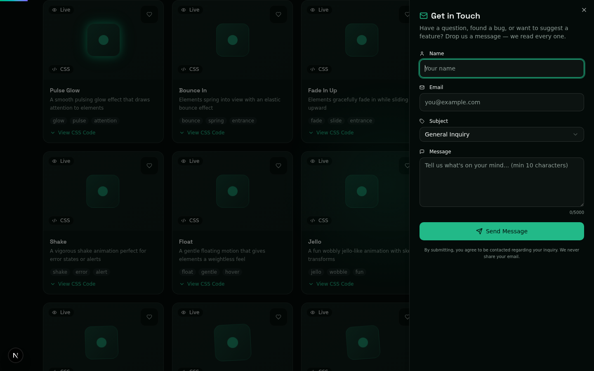 |
| **Color Customizer** | **Contact Form** |

</div>

---

## Tech Stack

| Layer | Technology |
|---|---|
| **Frontend** | Next.js 16 (App Router, Turbopack), TypeScript 5, Tailwind CSS 4, shadcn/ui (New York) |
| **Backend** | Express.js 4, TypeScript, Prisma ORM, Zod validation, JWT auth |
| **Database** | SQLite (dev) / Supabase Postgres (prod) — 45 Prisma models |
| **WebSocket** | Socket.io (Roy Live, port 3003) |
| **PWA** | Service Worker v2.1.0, manifest.json, 5 icons |
| **Testing** | Vitest (111 unit + 15 integration), Playwright (10 E2E specs), k6 (load tests) |
| **CI/CD** | GitHub Actions, Dependabot |
| **AI** | LLM client (OpenAI/Anthropic, mock fallback) |
| **Browser Automation** | Playwright + axe-core + Lighthouse |

---

## Project Structure

```
roycss/
├── src/                          # Next.js 16 frontend (App Router)
│   ├── app/                      # Routes + API routes
│   │   ├── page.tsx              # Homepage (the only user-visible route)
│   │   ├── layout.tsx            # Root layout (metadata, AuthProvider, PWA)
│   │   ├── proxy.ts               # CSP nonce middleware
│   │   └── api/                   # API routes (auth, effects, health, og)
│   ├── components/roycss/         # Platform components (100+ files)
│   │   ├── pro/                   # 62 platform product components
│   │   ├── tools/                 # 68 developer tool components
│   │   ├── effects/               # 7 WebGL/canvas effects
│   │   └── auth/                  # Auth UI (LoginSheet, RegisterSheet, UserMenu)
│   └── lib/                      # Shared libraries (effects, registry, types)
│
├── backend/                      # Express.js backend
│   ├── src/modules/               # 68 API modules (routes + service + schema)
│   ├── src/lib/                   # Shared libs (db, cache, llm-client, supabase)
│   ├── prisma/schema.prisma       # 45 Prisma models
│   └── tests/integration/          # 15 integration tests
│
├── mini-services/live-service/    # Socket.io WebSocket (port 3003)
├── mcp-server/                    # MCP Server for AI assistants
├── cli/                           # RoyCLI
├── vscode-extension/              # VS Code extension
├── public/                        # Static assets (PWA icons, manifest, sw.js, og.png)
├── dist/                          # Build artifacts (roycss.css, effects.json)
├── docs/                          # Documentation + audit reports + screenshots
├── scripts/                      # Build + utility scripts
├── tests/                        # Frontend tests (unit, e2e, load)
├── .github/                       # CI/CD workflows + dependabot
├── package.json                  # Frontend dependencies
├── tsconfig.json                 # TypeScript config
├── tailwind.config.ts            # Tailwind CSS 4 config
├── next.config.ts                # Next.js 16 config
└── README.md                     # You are here
```

---

## Getting Started

### Prerequisites

- [Bun](https://bun.sh/) (runtime + package manager)

### Installation

```bash
# Clone
git clone https://github.com/Roy-Wanyoike/roycss.git
cd roycss

# Install frontend + backend
bun install
cd backend && bun install && cd ..

# Set up backend environment
cp backend/.env.example backend/.env

# Initialize database
cd backend
bunx prisma generate
bunx prisma db push --schema=./prisma/schema.prisma
cd ..

# Build effects package
bun run build:package

# Start backend (port 4000)
cd backend && bun run --env-file=.env dev &

# Start frontend (port 3000)
bun run dev
```

Open `http://localhost:3000` — you should see 1,749 effects, 62 platform products, live previews, search (⌘K), and auth (Sign in / Create account).

---

## Scripts

```bash
# Frontend
bun run dev              # Dev server (port 3000)
bun run lint             # ESLint
bun run build            # Production build
bun run build:package    # Build dist/ artifacts
bun run test             # Unit tests (111 tests)

# Backend
cd backend
bun run dev              # Dev server (port 4000)
bun run typecheck        # TypeScript check
bun run test:integration # Integration tests (15 tests)
bun run db:push          # Push schema to database
```

---

## Environment Variables

See [`backend/.env.example`](backend/.env.example) for all variables.

**Required for dev**: `DATABASE_URL`, `JWT_SECRET`, `JWT_REFRESH_SECRET`
**Optional** (modules use mock fallback): `OPENAI_API_KEY`, `CDN_API_TOKEN`, `STORAGE_*`, `FIGMA_TOKEN`, `GITHUB_TOKEN`, `RESEND_API_KEY`, `SENTRY_DSN`

---

## Testing

| Suite | Tests | Status |
|---|---|---|
| Unit (Vitest) | 111 | ✅ All pass |
| Integration (Vitest + supertest) | 15 | ✅ All pass |
| Lint (ESLint) | 0 errors | ✅ Clean |
| Typecheck (tsc) | 0 errors | ✅ Clean |

---

## Architecture

```
Next.js 16 (port 3000)
    ↕
Express.js + Prisma (port 4000) — 68 modules, 45 models
    ↕
Socket.io (port 3003) — Roy Live real-time sessions
```

---

## Documentation

| Report | Location |
|---|---|
| Executive Audit | `docs/reports/ROYCSS_EXECUTIVE_AUDIT.md` |
| Feature Inventory | `docs/reports/ROYCSS_MASTER_FEATURE_INVENTORY.md` |
| Architecture | `docs/reports/ROYCSS_CURRENT_ARCHITECTURE.md` |
| API Report (270+ endpoints) | `docs/reports/ROYCSS_API_REPORT.md` |
| Database Report (45 models) | `docs/reports/ROYCSS_DATABASE_REPORT.md` |
| Security Report | `docs/reports/ROYCSS_SECURITY_REPORT.md` |
| Test Report | `docs/reports/ROYCSS_TEST_REPORT.md` |
| API Keys Required | `docs/reports/API_KEYS_REQUIRED.md` |
| Contributing | `docs/CONTRIBUTING.md` |

---

## License

MIT License — see [`LICENSE`](LICENSE).

---

<div align="center">

**Built by [Royford Wanyoike Wamaitha](https://github.com/Roy-Wanyoike)**

</div>
