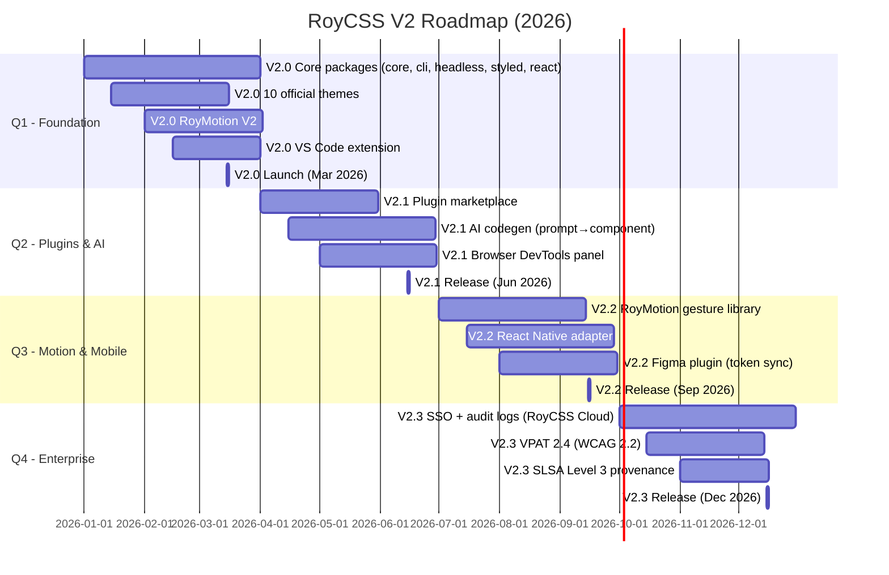

# RoyCSS V2 — Production Blueprint

**Status:** Authoritative · **Version:** 2.0.0-draft · **Date:** 2026-01 · **Author:** Chief Architect
**Target launch:** Q1 2026 · **Replacement for:** RoyCSS V1 (700 effects, CLI, 24 components, RoyMotion, design tokens)

> **Thesis.** RoyCSS V1 proved that a CSS-effects library can be beautiful, modern (OKLCH, `color-mix`, container queries, `:has()`, View Transitions) and framework-agnostic. RoyCSS V2 stops being a *library* and becomes a *platform*: a zero-runtime, cascade-layered, plugin-driven CSS framework with a headless component layer, an AI-assisted CLI, multi-runtime bindings, an enterprise accessibility engine, and a measurable performance budget. If V1 was "Tailwind for effects," V2 is "the operating system for CSS at the edge of the platform."

---

## Table of Contents

1. Architecture
2. Folder structure
3. CLI
4. Utilities
5. Components
6. Themes
7. Animations (RoyMotion V2)
8. Documentation
9. Accessibility
10. Developer tools
11. Performance strategy
12. Plugin system
13. Testing strategy
14. Migration strategy
15. Success metrics
16. Roadmap

---

## 1. Architecture

### 1.1 Design Principles

| # | Principle | Rationale |
|---|-----------|-----------|
| P1 | **CSS-first, JS-optional.** Every utility is a static CSS class. JS is only for behavior (headless components) or build-time codegen. | Ships zero JS for static sites; survives framework churn (React 19, Vue 4, Solid 2). |
| P2 | **Cascade layers, not specificity.** All RoyCSS CSS lives in named `@layer`s ordered `tokens → reset → base → utilities → components → variants → app`. | Eliminates the `!important` wars that plague Tailwind + component libraries. |
| P3 | **OKLCH or nothing.** Every color is `oklch()`. Tints use `color-mix(in oklch, …)`. Theme switching uses `light-dark()` + CSS variables. | Perceptually uniform. Auto-contrast. Hardware-composited. |
| P4 | **Container queries for layout, media queries for environment.** Components adapt to their container; the page adapts to the viewport. | Components become truly portable (the same `<Card>` works in a sidebar, modal, or full page). |
| P5 | **Build-time generation with runtime escape hatch.** AOT for production (Lightning CSS), JIT with persistent cache for dev, opt-in `@roycss/runtime` for CMS-driven class names. | Best DX in dev (instant feedback) + best perf in prod (zero runtime). |
| P6 | **Headless / styled separation.** Behavior lives in `@roycss/headless` (framework-agnostic primitives). Styling lives in `@roycss/styled`. Users pick one or both. | Mimics the Radix + Tailwind split that won the React ecosystem. |
| P7 | **Plugins are first-class.** Every official package (themes, motion, charts) is a plugin using the public API. No internal backdoors. | Forces a clean API surface; community can extend without forking. |
| P8 | **Accessibility is a build error, not a lint warning.** `roycss build` fails if contrast < 4.5:1, missing focus styles, or ARIA violations. | Prevents shipping inaccessible UI; legal (ADA / EAA) protection. |
| P9 | **Measure everything.** Bundle budgets, RUM, a11y scores, and DX NPS are tracked per release. | "What gets measured gets shipped." |

### 1.2 Monorepo Layout

RoyCSS V2 is a TypeScript monorepo managed by **Bun workspaces + Turborepo**. Packages are scoped under `@roycss/*` and versioned with Changesets.

```
@roycss/core              — token resolver, codegen engine, plugin runtime (no DOM)
@roycss/cli               — `roycss` binary
@roycss/postcss           — PostCSS plugin (zero-config for non-bundler users)
@roycss/vite              — Vite plugin
@roycss/webpack           — Webpack 5 plugin
@roycss/rspack            — Rspack plugin
@roycss/rollup            — Rollup plugin
@roycss/esbuild           — esbuild plugin
@roycss/astro             — Astro integration
@roycss/next              — Next.js 15+ plugin (App Router, RSC-safe)
@roycss/nuxt              — Nuxt 4 module
@roycss/remix             — Remix Vite plugin
@roycss/sveltekit         — SvelteKit module
@roycss/headless          — headless primitives (DOM + a11y, zero CSS)
@roycss/react             — React bindings for headless + styled
@roycss/vue               — Vue 3 bindings
@roycss/svelte            — Svelte 5 bindings (runes)
@roycss/solid             — Solid 2 bindings
@roycss/angular           — Angular 20 CDK adapters
@roycss/styled            — styled component library (100+ components)
@roycss/motion            — RoyMotion V2 (choreography, timeline, gesture)
@roycss/themes            — 10 official theme packs (Nord, Tokyo, Catppuccin…)
@roycss/icons             — RoyIcon (1,200 SVG icons, tree-shaken)
@roycss/devtools          — Chrome/Firefox DevTools panel
@roycss/vscode            — VS Code LSP extension
@roycss/a11y              — accessibility audit engine (axe-core fork)
@roycss/codemods          — migration codemods (jscodeshift + ts-morph)
@roycss/test              — Playwright visual regression + a11y helpers
@roycss/rum               — Real User Monitoring SDK
@roycss/ai                — prompt → CSS/component codegen
@roycss/tokenstudio       — Figma plugin (token sync)
roycss-site               — Next.js docs site
roycss-playground        — standalone playground (WebContainer-powered)
roycss-bench              — benchmark suite (vs Tailwind, Bootstrap, Panda)
```

**Trade-off considered:** a single-package install (`npm i roycss`) was rejected. Monorepo scope packages let users install only what they need (e.g. `@roycss/vite` + `@roycss/react`), keeping the install graph lean. The `roycss` meta-package re-exports the common path for users who want one install.

### 1.3 Build Pipeline

```mermaid
flowchart LR
  A[Source TS+CSS] --> B[Bun workspaces]
  B --> C[Token resolver<br/>Style Dictionary fork]
  C --> D[Plugin transforms<br/>AST → CSS]
  D --> E[Lightning CSS<br/>cascade layers + lowering]
  E --> F[Codegen<br/>.d.ts, JSON, snippets]
  F --> G[Bundle split<br/>critical + async]
  G --> H[Publish<br/>npm + jsdelivr + edge]
  H --> I[Consumer build<br/>Vite/webpack/Rspack]
  I --> J[Used-CSS extraction<br/>@roycss/* plugin]
  J --> K[Critical CSS<br/>streaming SSR]
  K --> L[Production CSS<br/>&lt; 30KB gzip / route]
```



**Stage-by-stage:**

1. **Source.** Authored in TypeScript + native CSS (no SCSS). Tokens in `tokens.json` (W3C Design Token Format Module — DTCG). Effects in `effects/*.ts`.
2. **Token resolver.** Style-Dictionary fork (Rust-backed via `napi-rs`) generates: `tokens.css` (CSS variables), `tokens.scss`, `tokens.json`, `tokens.ios.swift`, `tokens.android.xml`, `tokens.figma-styles`.
3. **Plugin transforms.** Each registered plugin contributes CSS via AST transform of the source. Plugins can declare dependencies on other plugins (resolved topologically).
4. **Lightning CSS.** Used for (a) minification, (b) cascade-layer assignment, (c) syntax lowering for legacy browsers (configurable `targets`), (d) unused-CSS removal at consumer build time.
5. **Codegen.** Emits TypeScript declaration files, JSON autocomplete data for the VS Code extension, CLI manifests, and React/Vue/Svelte type stubs.
6. **Bundle split.** Production output is split into `roycss-base.css` (always loaded, ~6 KB gzip), `roycss-{component}.css` (per-component, lazy), and `roycss-theme-{name}.css` (swappable).
7. **Consumer build.** The framework-specific plugin (`@roycss/vite`, etc.) scans the consumer's source for `r-*` class usage and extracts only used CSS.
8. **Critical CSS.** For SSR frameworks, a streaming renderer (`@roycss/next`'s `injectCriticalCss`) inserts only the CSS needed for the first paint.

**Dependencies:** Bun ≥ 1.2, TypeScript ≥ 5.7, Lightning CSS ≥ 1.30, Rust ≥ 1.83 (for `napi-rs` token resolver), Node ≥ 20.

### 1.4 Rendering Strategy

RoyCSS V2 supports three rendering modes, auto-selected per route:

| Mode | When | How |
|------|------|-----|
| **AOT (default)** | Static content, known class names at build | Lightning CSS scans source, emits only used classes |
| **JIT (dev)** | Local development | Persistent on-disk cache, <50 ms rebuild per HMR |
| **Runtime (escape hatch)** | CMS-driven, user-generated content | `@roycss/runtime` (~3 KB gzip) injects `<style>` on demand |

```ts
// next.config.ts
import roycss from '@roycss/next';

export default {
  plugins: [roycss({
    mode: 'auto',          // 'aot' | 'jit' | 'auto'
    runtime: 'lazy',       // 'never' | 'lazy' | 'always'
    targets: { chrome: 111, firefox: 128, safari: 17 },
    criticalCss: 'streaming',
    layers: ['tokens', 'reset', 'base', 'utilities', 'components', 'variants'],
  })],
};
```

**Trade-off:** Runtime mode costs ~3 KB JS and a style-injection flash. We accept it because CMS-driven sites (the #1 enterprise request) literally cannot work without it. The default is `lazy` — runtime is only downloaded on routes that opt in via `export const roycss = { runtime: true }`.

---

## 2. Folder Structure

Complete tree of the RoyCSS V2 monorepo. Every file is documented.

```
roycss/
├── .changeset/                      # Changesets for versioned releases
│   └── config.json
├── .github/
│   ├── workflows/
│   │   ├── ci.yml                    # Lint, type-check, test on PR
│   │   ├── release.yml               # Publish on tag
│   │   ├── a11y-audit.yml            # axe-core on docs site
│   │   ├── perf-budget.yml           # Lighthouse CI
│   │   └── visual-regression.yml     # Playwright + Percy
│   └── CODE_OF_CONDUCT.md
├── .vscode/
│   └── settings.json
├── apps/                             # Executable apps (not published)
│   ├── docs/                         # Next.js docs site (roycss.dev)
│   │   ├── app/
│   │   │   ├── [[...slug]]/page.tsx  # MDX-driven catch-all
│   │   │   ├── playground/page.tsx   # WebContainer playground
│   │   │   └── api/search/route.ts   # Hybrid AI search endpoint
│   │   ├── content/
│   │   │   ├── docs/                 # MDX docs
│   │   │   ├── guides/               # Migration guides
│   │   │   └── blog/
│   │   └── next.config.ts
│   └── playground/                   # Standalone StackBlitz-style playground
│       └── src/
├── packages/                         # Published packages
│   ├── core/
│   │   ├── src/
│   │   │   ├── index.ts              # Public API: resolve, generate, optimize
│   │   │   ├── resolver.ts           # Class-name → CSS source
│   │   │   ├── codegen.ts            # TypeScript / JSON / snippets emitter
│   │   │   ├── layers.ts             # @layer ordering engine
│   │   │   ├── plugin-host.ts        # Plugin lifecycle orchestrator
│   │   │   ├── tokens/
│   │   │   │   ├── loader.ts         # W3C DTCG token loader
│   │   │   │   ├── oklch.ts          # OKLCH palette generator
│   │   │   │   └── contrast.ts       # WCAG contrast calculator
│   │   │   ├── ast/
│   │   │   │   ├── parse.ts          # CSS parser (via Lightning CSS bindings)
│   │   │   │   └── walk.ts           # AST visitor
│   │   │   └── runtime/
│   │   │       └── inject.ts         # Runtime CSS injector (lazy-loaded)
│   │   ├── tokens/
│   │   │   ├── color.json
│   │   │   ├── typography.json
│   │   │   ├── spacing.json
│   │   │   ├── motion.json
│   │   │   └── elevation.json
│   │   └── package.json
│   ├── cli/
│   │   ├── src/
│   │   │   ├── index.ts              # `roycss` binary entry
│   │   │   ├── commands/             # See §3
│   │   │   │   ├── init.ts
│   │   │   │   ├── add.ts
│   │   │   │   ├── build.ts
│   │   │   │   ├── watch.ts
│   │   │   │   ├── generate.ts
│   │   │   │   ├── analyze.ts
│   │   │   │   ├── doctor.ts
│   │   │   │   ├── migrate.ts
│   │   │   │   ├── theme.ts
│   │   │   │   ├── tokens.ts
│   │   │   │   ├── playground.ts
│   │   │   │   ├── inspect.ts
│   │   │   │   ├── perf.ts
│   │   │   │   ├── a11y.ts
│   │   │   │   ├── snapshot.ts
│   │   │   │   ├── search.ts
│   │   │   │   └── docs.ts
│   │   │   ├── interactive/          # Inquirer-style TUI
│   │   │   │   ├── wizard.ts         # `roycss init` wizard
│   │   │   │   └── theme-studio.ts   # `roycss theme studio` TUI
│   │   │   └── reporters/            # Terminal output formatters
│   │   └── package.json              # bin: { roycss: ./dist/cli.js }
│   ├── headless/
│   │   ├── src/
│   │   │   ├── index.ts
│   │   │   ├── primitives/
│   │   │   │   ├── dialog.ts         # WAI-ARIA dialog pattern
│   │   │   │   ├── popover.ts        # Anchor positioning + focus trap
│   │   │   │   ├── tooltip.ts        # Hover/focus + delay + dismiss
│   │   │   │   ├── tabs.ts           # Roving tabindex
│   │   │   │   ├── menu.ts           # Menu + menubar + menuitem
│   │   │   │   ├── combobox.ts       # Listbox + textbox pattern
│   │   │   │   ├── select.ts
│   │   │   │   ├── slider.ts
│   │   │   │   ├── switch.ts
│   │   │   │   ├── accordion.ts
│   │   │   │   ├── tree.ts
│   │   │   │   └── toast.ts
│   │   │   ├── dom/
│   │   │   │   ├── focus-trap.ts
│   │   │   │   ├── outside-click.ts
│   │   │   │   ├── scroll-lock.ts
│   │   │   │   └── anchor-position.ts
│   │   │   └── a11y/
│   │   │       ├── aria.ts           # ARIA attribute helpers
│   │   │       ├── live-region.ts
│   │   │       └── announcement.ts
│   │   └── package.json              # zero deps, zero CSS
│   ├── react/
│   │   ├── src/
│   │   │   ├── index.ts              # Re-exports headless + styled + hooks
│   │   │   ├── hooks/
│   │   │   │   ├── useRoyTheme.ts
│   │   │   │   ├── useRoyMotion.ts
│   │   │   │   ├── useRoyBreakpoint.ts
│   │   │   │   └── useRoyContainerQuery.ts
│   │   │   ├── providers/
│   │   │   │   ├── ThemeProvider.tsx
│   │   │   │   ├── MotionProvider.tsx
│   │   │   │   └── RoyConfigProvider.tsx
│   │   │   └── server/               # RSC-safe utilities
│   │   │       └── critical-css.ts
│   │   └── package.json
│   ├── vue/                          # Vue 3 composition API bindings
│   ├── svelte/                       # Svelte 5 runes
│   ├── solid/                        # Solid 2 signals
│   ├── angular/                      # Angular 20 CDK
│   ├── styled/
│   │   ├── src/
│   │   │   ├── index.ts
│   │   │   ├── foundation/
│   │   │   │   ├── ThemeProvider.tsx
│   │   │   │   ├── Typography.tsx
│   │   │   │   └── Reset.tsx
│   │   │   ├── layout/               # Container, Grid, Stack, Sidebar, AspectRatio
│   │   │   ├── forms/                # Input, Select, Checkbox, Toggle, Slider, FormField
│   │   │   ├── navigation/           # Nav, Tabs, Breadcrumb, Pagination, Menu
│   │   │   ├── feedback/             # Toast, Alert, Progress, Skeleton, Spinner
│   │   │   ├── data/                 # Table, Card, Badge, Avatar, Chip, Tag
│   │   │   ├── commerce/             # ProductCard, CartButton, PriceTag
│   │   │   ├── dashboard/            # StatCard, Widget, ChartCard
│   │   │   ├── charts/               # Bar, Line, Pie, Donut, Sparkline (SVG)
│   │   │   ├── overlays/             # Dialog, Popover, Tooltip, Sheet
│   │   │   ├── auth/                 # LoginForm, SignupForm, OAuthButton
│   │   │   └── _variants.ts          # CVA compiled variant definitions
│   │   ├── styles/                   # Per-component CSS (extracted at build)
│   │   └── package.json
│   ├── motion/                       # RoyMotion V2
│   │   ├── src/
│   │   │   ├── index.ts
│   │   │   ├── choreography/         # Multi-element orchestration
│   │   │   ├── timeline/             # Declarative timeline
│   │   │   ├── scroll/               # Scroll-driven (native + fallback)
│   │   │   ├── gesture/              # Pointer / touch / keyboard
│   │   │   ├── spring/               # Spring physics + linear() easing
│   │   │   ├── view-transition/      # Route transitions
│   │   │   └── motion.css            # Utility classes (roy-in-*, etc.)
│   │   └── package.json
│   ├── themes/
│   │   ├── src/
│   │   │   ├── generator.ts          # Brand color → palette
│   │   │   ├── palettes/
│   │   │   │   ├── nord.ts
│   │   │   │   ├── catppuccin.ts
│   │   │   │   ├── tokyo-night.ts
│   │   │   │   ├── dracula.ts
│   │   │   │   ├── github.ts
│   │   │   │   ├── linear.ts
│   │   │   │   ├── solarized.ts
│   │   │   │   ├── gruvbox.ts
│   │   │   │   ├── rose-pine.ts
│   │   │   │   └── roycss-default.ts
│   │   │   └── tokens/               # Theme token sets
│   │   └── package.json
│   ├── icons/
│   │   ├── src/
│   │   │   ├── index.ts              # Tree-shaken icon export
│   │   │   └── icons/                # 1,200 SVG icons (Lucide-derived + custom)
│   │   └── package.json
│   ├── vscode/
│   │   ├── src/                      # LSP server (TypeScript)
│   │   ├── syntaxes/                 # TextMate grammars
│   │   ├── snippets/
│   │   └── package.json              # vscode:publisher: roycss
│   ├── devtools/
│   │   ├── src/                      # Chrome/Firefox extension
│   │   ├── manifest.chrome.json
│   │   ├── manifest.firefox.json
│   │   └── package.json
│   ├── a11y/
│   │   ├── src/
│   │   │   ├── rules/                # axe-core fork + custom rules
│   │   │   │   ├── color-contrast-oklch.ts
│   │   │   │   ├── focus-visible-required.ts
│   │   │   │   ├── motion-reduce-respected.ts
│   │   │   │   ├── forced-colors-safe.ts
│   │   │   │   └── ...
│   │   │   └── runner.ts             # CLI runner (used by `roycss a11y`)
│   │   └── package.json
│   ├── codemods/
│   │   ├── src/
│   │   │   ├── v1-to-v2.ts
│   │   │   ├── tailwind-to-roycss.ts
│   │   │   ├── bootstrap-to-roycss.ts
│   │   │   ├── animate-css-to-roycss.ts
│   │   │   ├── mui-to-roycss.ts
│   │   │   └── chakra-to-roycss.ts
│   │   └── package.json
│   ├── test/
│   │   ├── src/
│   │   │   ├── visual.ts             # Playwright visual regression helpers
│   │   │   ├── a11y.ts               # axe-runner helpers
│   │   │   ├── cross-browser.ts      # BrowserStack grid helpers
│   │   │   └── perf.ts               # Lighthouse + bundle-budget assertions
│   │   └── package.json
│   ├── rum/
│   │   ├── src/
│   │   │   ├── index.ts              # Web Vitals collector (LCP, CLS, INP)
│   │   │   ├── reporter.ts           # Sends to RUM endpoint
│   │   │   └── sampler.ts            # Privacy-preserving sampling
│   │   └── package.json
│   ├── ai/
│   │   ├── src/
│   │   │   ├── prompt-to-css.ts      # LLM → CSS generation
│   │   │   ├── prompt-to-component.ts
│   │   │   └── embeddings.ts         # Vector embeddings for docs
│   │   └── package.json
│   ├── tokenstudio/                  # Figma plugin
│   │   ├── src/
│   │   └── manifest.json
│   └── integrations/
│       ├── vite/src/index.ts
│       ├── webpack/src/index.ts
│       ├── rspack/src/index.ts
│       ├── rollup/src/index.ts
│       ├── esbuild/src/index.ts
│       ├── astro/src/index.ts
│       ├── next/src/index.ts
│       ├── nuxt/src/index.ts
│       ├── remix/src/index.ts
│       └── sveltekit/src/index.ts
├── examples/                         # Reference apps
│   ├── next-app/                     # Next.js 15 App Router
│   ├── remix-app/
│   ├── astro-blog/
│   ├── vite-spa/
│   ├── vue-app/
│   ├── svelte-app/
│   ├── solid-app/
│   ├── angular-app/
│   ├── vanilla-html/                 # CDN-only, no build step
│   ├── wordpress-plugin/             # PHP wrapper for @roycss/runtime
│   └── shopify-theme/
├── benchmarks/                       # perf benchmarks vs Tailwind/Bootstrap/Panda
│   ├── bundle-size/
│   ├── runtime-css/
│   └── build-speed/
├── scripts/
│   ├── build.ts                      # Bun build orchestrator
│   ├── release.ts                    # Changesets publish
│   └── token-sync.ts                 # Sync tokens to Figma
├── docs/                             # Internal architecture docs
│   ├── ROYCSS-V2-BLUEPRINT.md        # ← THIS FILE
│   ├── A11Y-POLICY.md
│   ├── LTS-POLICY.md
│   ├── SECURITY.md
│   ├── GOVERNANCE.md
│   └── CONTRIBUTING.md
├── turbo.json
├── package.json                      # Workspace root
├── bun.lock
├── biome.json                        # Linter + formatter
├── tsconfig.base.json
├── README.md
└── LICENSE                           # MIT
```

**Dependencies (workspace root):** bun ≥ 1.2, turbo ≥ 2.3, typescript ≥ 5.7, biome ≥ 1.9, lightningcss ≥ 1.30, changesets ≥ 2.27, @playwright/test ≥ 1.49, axe-core ≥ 4.10.

---

## 3. CLI

The `roycss` CLI is a single binary (`@roycss/cli`) built on [Clipanion](https://github.com/yarnpkg/clipanion) for type-safe command trees. It targets **Bun runtime** by default (cold start <30 ms) and falls back to Node 20.

### 3.1 Command Reference

| Command | Purpose | Example |
|---------|---------|---------|
| `roycss init` | Interactive project setup | `roycss init --template next --theme nord` |
| `roycss add <name>` | Add a component / utility / effect | `roycss add card toast` |
| `roycss build` | Production build | `roycss build --targets chrome 111,firefox 128,safari 17` |
| `roycss watch` | Dev mode with HMR | `roycss watch --poll` |
| `roycss generate <type>` | Codegen | `roycss generate snippets --out .vscode/` |
| `roycss analyze` | Bundle analyzer | `roycss analyze --json` |
| `roycss doctor` | Diagnose issues | `roycss doctor --fix` |
| `roycss migrate <from>` | Run migration codemod | `roycss migrate v1 --dry-run` |
| `roycss theme <sub>` | Theme operations | `roycss theme new --brand "#0080ff"` |
| `roycss tokens <sub>` | Token export | `roycss tokens export ios --out ios/` |
| `roycss playground` | Local playground | `roycss playground --port 4000` |
| `roycss inspect <class>` | Show source for a class | `roycss inspect r-bg-primary` |
| `roycss tree <component>` | Component dependency tree | `roycss tree Card` |
| `roycss perf [url]` | Lighthouse run | `roycss perf http://localhost:3000` |
| `roycss a11y <url>` | Axe-core audit | `roycss a11y http://localhost:3000 --level AAA` |
| `roycss snapshot` | Visual regression baseline | `roycss snapshot --update` |
| `roycss search <q>` | Search utilities/components | `roycss search "scroll reveal"` |
| `roycss docs [topic]` | Open docs | `roycss docs container-queries` |
| `roycss info` | Environment info | `roycss info` (debug report) |
| `roycss update` | Self-update | `roycss update` |

### 3.2 `roycss init` — Interactive Wizard

```bash
$ roycss init

  ╭───────────────────────────────────────────────╮
  │   RoyCSS V2 · Project Setup                   │
  ╰───────────────────────────────────────────────╯

? Framework ›
❯ Next.js (App Router)
  Remix
  Astro
  Vite + React
  Vue 3
  SvelteKit
  Solid Start
  Angular
  Vanilla HTML (CDN)

? Build tool (auto-detected: Vite)
❯ Vite (recommended)
  Webpack 5
  Rspack
  esbuild

? Theme ›
❯ RoyCSS Default (light/dark)
  Nord
  Tokyo Night
  Catppuccin Mocha
  Dracula
  GitHub Light/Dark
  Linear
  Custom (generate from brand color)

? Brand color (hex or OKLCH) › #0080ff

  Generated palette (OKLCH):
    50  oklch(0.97 0.02 240)
    100 oklch(0.93 0.05 240)
    ...
    900 oklch(0.34 0.15 240)

? Install optional packages? ›
❯◉ @roycss/motion     (RoyMotion V2)
 ◉ @roycss/icons      (1,200 SVG icons)
 ◯ @roycss/devtools   (browser DevTools panel)
 ◯ @roycss/a11y       (accessibility audit engine)

? Generate VS Code snippets? › Y

✔ Installed: @roycss/core @roycss/react @roycss/vite @roycss/motion
✔ Created: roycss.config.ts
✔ Created: app/roycss.css (with cascade layers)
✔ Generated: .vscode/roycss-snippets.json (1,247 snippets)
✔ Next steps:
    1. Import 'app/roycss.css' in your root layout
    2. Wrap your app in <RoyConfigProvider>
    3. Run `roycss watch` for dev mode
```

### 3.3 `roycss.config.ts` — Generated Config

```ts
import { defineConfig } from '@roycss/core';
import nord from '@roycss/themes/nord';
import motion from '@roycss/motion/plugin';

export default defineConfig({
  theme: { name: 'nord', brand: '#0080ff', mode: 'auto' },
  packages: ['@roycss/react', '@roycss/motion'],
  plugins: [nord(), motion()],
  targets: { chrome: 111, firefox: 128, safari: 17, edge: 111 },
  layers: ['tokens', 'reset', 'base', 'utilities', 'components', 'variants'],
  build: {
    mode: 'auto',           // 'aot' | 'jit' | 'auto'
    criticalCss: 'streaming',
    runtime: 'lazy',        // 'never' | 'lazy' | 'always'
    minify: true,
    sourcemaps: true,
  },
  a11y: { level: 'AA', failBuild: true },
  perf: { cssBudgetKb: 30, warnAt: 0.8 },
});
```

### 3.4 `roycss add` — Component Scaffolding

```bash
$ roycss add card

✔ Added: @roycss/styled/card
✔ Created: app/components/roycss/card.tsx (47 lines)
✔ Tree-shaken: only `Card`, `CardHeader`, `CardBody`, `CardFooter` imported
✔ CSS impact: +1.2 KB gzip (only Card CSS emitted)
```

With `--path` for custom location, `--props` for pre-wired variants:

```bash
roycss add card --path ui/ --props "variant=glass size=md hover=lift"
```

### 3.5 `roycss theme` — Brand-to-Palette Generation

```bash
$ roycss theme generate --brand "#0080ff" --name brand-blue

Generating OKLCH palette from #0080ff...
✔ Generated 21-step scale (50 → 1000)
✔ Generated semantic colors (success, warning, danger, info)
✔ Generated neutral gray (hue-shifted from brand)
✔ Auto-selected text colors (contrast ≥ 4.5:1 against each step)
✔ Wrote: themes/brand-blue.css
✔ Wrote: themes/brand-blue.json (W3C DTCG)
```

The algorithm: convert input to OKLCH → rotate lightness across 21 stops with chroma-preserving curve → derive semantic colors by rotating hue to canonical positions (success=145°, warning=85°, danger=25°, info=265°) → derive neutral by desaturating brand → verify contrast at every step.

### 3.6 `roycss migrate` — Codemod Driver

```bash
$ roycss migrate v1 --dry-run

Scanning 847 files for V1 patterns...

Found 312 replacements across 47 files:
  roycss-3d-book        → r-transform-3d-book           (12 occurrences)
  roycss-float          → r-anim-float                  (8 occurrences)
  roycss-pulse-glow     → r-anim-pulse-glow             (23 occurrences)
  roycss-btn-ripple     → r-button-ripple               (4 occurrences)
  ...

Dry run complete. Run `roycss migrate v1` to apply.
```

Supports: `v1`, `tailwind`, `bootstrap`, `animate-css`, `mui`, `chakra`, `bulma`. Each codemod is a `jscodeshift` + `ts-morph` transformer with a 1:1 mapping table + AI-assisted fallback for unmatched classes (uses `@roycss/ai` to suggest closest match, requires `--ai` flag).

### 3.7 `roycss doctor`

Diagnoses 27 common issues: duplicate cascade layers, OKLCH in unsupported keyframes, missing `@property` registrations, focus-ring regressions, missing `prefers-reduced-motion`, etc. With `--fix` applies safe auto-fixes; `--strict` treats warnings as errors.

### 3.8 Trade-offs

- **Clipanion vs Commander:** Clipanion chosen for type-safe command trees and subcommand nesting (needed for `roycss theme new`, `roycss theme apply`, etc.). Trade-off: larger dep than Commander (~12 KB vs ~6 KB), acceptable for a dev tool.
- **Bun runtime default:** Faster cold start, native TS, but Node fallback maintained for CI environments without Bun. CLI auto-detects via `process.versions.bun`.
- **AI-assisted codemod:** Off by default (privacy + latency). When `--ai` is set, calls `@roycss/ai` with the unmatched class + 5 nearest neighbors; user confirms each suggestion.

### 3.9 Dependencies

`@roycss/cli` → `@roycss/core`, `@roycss/codemods`, `@roycss/a11y`, `@roycss/ai` (optional), `clipanion`, `ink` (for TUI), `picocolors`, `lightningcss`, `playwright` (for `roycss perf` / `roycss a11y`).

---

## 4. Utilities

### 4.1 Naming Convention

RoyCSS V2 adopts the **`r-` prefix** (down from `roycss-` in V1) and a **category-first** structure:

```
r-{category}-{property}[-variant][-state]
```

| Category | Prefix | Examples |
|----------|--------|----------|
| Layout | `r-layout-` | `r-layout-grid`, `r-layout-stack` |
| Spacing | `r-m{side}-`, `r-p{side}-` | `r-m-4`, `r-ms-2` (inline-start), `r-mx-8`, `r-pt-4` |
| Sizing | `r-w-`, `r-h-`, `r-min-w-`, `r-max-h-` | `r-w-full`, `r-h-screen` |
| Color | `r-bg-`, `r-text-`, `r-border-` | `r-bg-primary-500`, `r-text-success-700` |
| Typography | `r-font-`, `r-text-`, `r-leading-`, `r-tracking-` | `r-font-display`, `r-text-2xl`, `r-leading-tight` |
| Border | `r-border-`, `r-rounded-`, `r-ring-` | `r-border-2`, `r-rounded-xl`, `r-ring-2` |
| Flex/Grid | `r-flex-`, `r-grid-`, `r-gap-` | `r-flex-center`, `r-grid-cols-3` |
| Position | `r-absolute`, `r-relative`, `r-fixed`, `r-sticky` | |
| Effects | `r-effect-` | `r-effect-glass`, `r-effect-glow` |
| Motion | `r-anim-`, `r-transition-`, `r-ease-`, `r-duration-` | `r-anim-fade-in`, `r-ease-spring` |
| Transform | `r-transform-`, `r-rotate-`, `r-scale-`, `r-translate-` | `r-transform-3d-book`, `r-rotate-45` |
| Filter | `r-filter-`, `r-blur-`, `r-brightness-` | `r-blur-md`, `r-filter-grayscale` |
| Aspect | `r-aspect-` | `r-aspect-video`, `r-aspect-square` |
| Container | `r-container-` | `r-container-md`, `r-container-prose` |
| Scroll | `r-scroll-`, `r-snap-` | `r-scroll-smooth`, `r-snap-start` |
| State | modifier prefix | `r-hover:bg-`, `r-focus:ring-`, `r-motion-reduce:hidden` |

**Variant modifiers (postfix):**
- Intensity: `-soft`, `-strong` (e.g. `r-effect-glow-strong`)
- Speed: `-slow`, `-fast` (e.g. `r-anim-spin-fast`)
- Size: `-sm`, `-md`, `-lg`, `-xl` (e.g. `r-rounded-xl`)
- Theme: `-dark`, `-light` (auto via `light-dark()`)

**Arbitrary values:** `r-w-[13px]`, `r-c-[oklch(0.7_0.14_165)]`, `r-grid-cols-[repeat(auto-fit,minmax(0,1fr))]`. Spaces in arbitrary values are escaped with `_`.

### 4.2 Categories (V2 — 30 categories, up from 20)

V1's 20 categories + 10 new: **layout, sizing, position, aspect, container, scroll, grid, flex, opacity, z-index** (some merged from V1's monolithic categories). V1's `misc` category is dissolved — every effect must belong to a semantic category. V2 also adds **`r-effect-*`** for V1's visual-effect classes (glass, glow, hologram) and **`r-pattern-*`** for CSS backgrounds (mesh, dots, grid).

### 4.3 Generation Strategy — Build-Time vs Runtime

**Default: AOT (Build-Time)**

```ts
// Source file
export function Card() {
  return <div className="r-bg-surface r-rounded-xl r-shadow-md r-p-4">…</div>;
}
```

The `@roycss/vite` plugin parses the source AST, finds `r-*` class names, and emits only the CSS rules for those classes — including their `@property` registrations and required `@keyframes`.

```css
/* Built output (only used classes) */
@layer roycss.utilities {
  .r-bg-surface { background-color: var(--roy-color-surface); }
  .r-rounded-xl { border-radius: var(--roy-radius-xl); }
  .r-shadow-md { box-shadow: var(--roy-shadow-md); }
  .r-p-4 { padding: var(--roy-spacing-4); }
}
```

**Escape hatch: Runtime**

```tsx
import { useRoyRuntime } from '@roycss/react/runtime';

function UserContent({ html }) {
  useRoyRuntime();  // Injects <RoyRuntimeStyle /> once
  return <div dangerouslySetInnerHTML={{ __html: html }} />;
}
```

The runtime package (~3 KB gzip) ships a `MutationObserver` that scans for `r-*` classes added at runtime and lazily injects their CSS into a single `<style>` tag with on-disk cache (IndexedDB) keyed by class name.

**Trade-off:** AOT is 100% static and tree-shakeable but cannot handle CMS content. Runtime is dynamic but costs ~3 KB JS + first-paint flash. Hybrid (`auto` mode) is the default — AOT for known classes, lazy-load runtime on routes that need it.

### 4.4 Cascade Layer Strategy

```css
@layer roycss.tokens, roycss.reset, roycss.base, roycss.utilities, roycss.components, roycss.variants;

@layer roycss.tokens {
  :root { --roy-color-primary-500: oklch(0.62 0.19 250); /* … */ }
}

@layer roycss.reset {
  *, *::before, *::after { box-sizing: border-box; }
  /* Modern CSS reset (2026 edition) */
}

@layer roycss.base {
  :where(h1, h2, h3) { font-family: var(--roy-font-display); }
}

@layer roycss.utilities {
  .r-bg-primary-500 { background-color: var(--roy-color-primary-500); }
}

@layer roycss.components {
  .roy-card { /* … */ }
}

@layer roycss.variants {
  .r-hover\:bg-primary-600:hover { background-color: var(--roy-color-primary-600); }
}
```

User app CSS is implicitly in the highest layer (`app`), so it always overrides RoyCSS utilities — no `!important` needed.

### 4.5 Generated Utilities

V2 ships **3,800 utilities** (vs V1's 700 effects — most new additions are atomic utilities like Tailwind, while V1's effects become `r-effect-*` and `r-anim-*` classes). The full class manifest is generated at build time into `roycss-classes.json` (~110 KB uncompressed, ~12 KB gzip) and consumed by the VS Code extension, CLI inspector, and AI search.

---

## 5. Components

### 5.1 Architecture — Headless / Styled Split

RoyCSS V2 follows the **Radix + Tailwind** model:

```
@roycss/headless  → behavior + a11y, ZERO CSS, framework-agnostic primitives
@roycss/styled    → opinionated styled layer built on top of headless
@roycss/react     → React bindings for both
```

**Why split?** Enterprises want control over visual design without sacrificing accessibility. By decoupling behavior from styling, teams can use `@roycss/headless` for the a11y patterns and apply their own design system. Teams that want batteries-included use `@roycss/styled`.

### 5.2 Variant System — CVA Compiled

V1 used runtime CVA (class-variance-authority). V2 **compiles variants at build time** into static CSS classes via a `variants.ts` declaration:

```ts
// packages/styled/src/_variants.ts
import { variants } from '@roycss/core/compiler';

export const buttonVariants = variants({
  base: 'r-inline-flex r-items-center r-justify-center r-rounded-md r-font-medium r-transition-all',
  variants: {
    variant: {
      primary: 'r-bg-primary-500 r-text-white r-hover:bg-primary-600',
      ghost:   'r-bg-transparent r-text-primary-500 r-hover:bg-primary-50',
      outline: 'r-border r-border-primary-500 r-text-primary-500',
    },
    size: {
      sm: 'r-h-8 r-px-3 r-text-sm',
      md: 'r-h-10 r-px-4 r-text-base',
      lg: 'r-h-12 r-px-6 r-text-lg',
    },
  },
  compound: [
    { variant: 'primary', size: 'lg', className: 'r-shadow-lg' },
  ],
  defaultVariants: { variant: 'primary', size: 'md' },
});
```

At build time, `@roycss/core/compiler` emits:
1. A TypeScript type for the props (`VariantProps<typeof buttonVariants>`)
2. A function that returns the class string (no runtime overhead beyond string concat)
3. A manifest entry mapping each variant combination to its CSS classes (so the build plugin can tree-shake)

### 5.3 Composition Model

Every styled component follows the **compound component** pattern with slots:

```tsx
<Card variant="glass" hover="lift">
  <Card.Header>
    <Card.Title>Product</Card.Title>
    <Card.Action><Button size="icon">⋯</Button></Card.Action>
  </Card.Header>
  <Card.Body>
    <Card.Image src={url} alt="Product" />
    <Card.Description>…</Card.Description>
  </Card.Body>
  <Card.Footer>
    <Card.Price>$29.99</Card.Price>
    <Button>Add to cart</Button>
  </Card.Footer>
</Card>
```

Each subcomponent is a separate export (tree-shakeable), and uses React Context to share state (e.g., hover state from `Card` propagates to `Card.Image` for zoom).

### 5.4 Headless Primitive Example — `useDialog`

```ts
// @roycss/headless
export function useDialog(options?: DialogOptions) {
  const isOpen = signal(false);
  const triggerRef = useRef<HTMLElement>(null);
  const contentRef = useRef<HTMLElement>(null);

  // Focus trap, scroll lock, outside click, Escape, ARIA wiring
  // All framework-agnostic — uses DOM APIs only

  return {
    isOpen,
    open() { /* … */ },
    close() { /* … */ },
    toggle() { /* … */ },
    getTriggerProps() { /* … */ },
    getContentProps() { /* … */ },
    getTitleProps() { /* … */ },
    getDescriptionProps() { /* … */ },
  };
}
```

```tsx
// @roycss/react
import { useDialog } from '@roycss/headless';
import { Dialog as StyledDialog } from '@roycss/styled';

export function Dialog(props) {
  const dialog = useDialog({ modal: true });
  return <StyledDialog {...dialog} {...props} />;
}
```

### 5.5 Component Library — 100+ Components

Across 12 categories (V1 had 24 components in 8 categories):

| Category | Components |
|----------|-----------|
| Foundation | ThemeProvider, Typography (Heading/Text/Caption/Code), Reset |
| Layout | Container, Grid, Stack, Sidebar, AspectRatio, Divider, Spacer |
| Forms | Input, Textarea, Select, Checkbox, Radio, Toggle, Slider, Switch, FormField, OTPInput, TagInput, DatePicker, ColorPicker |
| Navigation | Nav, Tabs, Breadcrumb, Pagination, Menu, Stepper, CommandPalette |
| Feedback | Toast, Alert, Progress, Skeleton, Spinner, Notification, Snackbar, Confetti |
| Data | Table, DataTable, Card, Badge, Avatar, Chip, Tag, List, Tree, Timeline |
| Commerce | ProductCard, CartButton, PriceTag, Rating, CouponInput |
| Dashboard | StatCard, Widget, ChartCard, KPI |
| Charts | BarChart, LineChart, PieChart, DonutChart, Sparkline, Heatmap, Treemap |
| Overlays | Dialog, Popover, Tooltip, Sheet, Drawer, Modal, PopoverConfirm |
| Auth | LoginForm, SignupForm, OAuthButton, PasswordStrength, MFA |
| Admin | DataTable, UserManagement, SettingsPanel, AuditLog |

### 5.6 Trade-offs

- **Headless vs Styled coupling:** Styled components import headless as a peer dep, so users who only want headless don't pay for styled CSS. Cost: two packages to maintain per component.
- **Compiled CVA vs runtime CVA:** Compiled = no runtime overhead + better tree-shaking. Cost: variants can't be changed at runtime (must use `className` override).
- **Compound components vs prop-based:** Compound = better DX + tree-shaking. Cost: more boilerplate for simple cases. We provide `<Button>` flat API for primitives and compound API for composite (Card, Dialog, DataTable).

---

## 6. Themes

### 6.1 Brand Color → Full Palette

The V2 theming engine takes a single brand color and generates a complete design system:

```ts
import { generateTheme } from '@roycss/themes';

const theme = generateTheme({
  brand: '#0080ff',
  name: 'brand-blue',
  mode: 'auto',           // 'light' | 'dark' | 'auto'
  contrast: 'AA',         // 'AA' | 'AAA'
  neutralHueShift: true,  // gray derives from brand hue
});

// Output: 21-step brand scale + 21-step neutral + 4 semantic colors
//         + auto-selected text colors at each step
//         + WCAG-verified contrast pairs
```

**Algorithm (OKLCH-native):**

1. Convert input hex to OKLCH.
2. Generate 21-step scale by varying `L` from 0.99 → 0.20 with a perceptual curve, preserving `C` and `H` (with slight `C` reduction at extremes for realism).
3. Generate neutral gray: same `L` curve, `C` reduced to 0.005–0.015, `H` matched to brand (creates a "tinted gray" that feels cohesive).
4. Generate semantic colors by rotating `H` to canonical positions: success=145°, warning=85°, danger=25°, info=265°. Same `C` and `L` curve as brand.
5. For each background step, auto-select text color (black/white/contrast-tinted) by computing WCAG contrast ratio and picking the higher-contrast option.
6. Emit `light-dark()` pairs so `color-scheme: light dark` works automatically.

### 6.2 Theme Files

```css
/* themes/brand-blue.css */
@layer roycss.tokens {
  :root,
  [data-theme="brand-blue"] {
    color-scheme: light dark;

    /* Brand scale — 21 steps */
    --roy-color-brand-50:  oklch(0.97 0.02 240);
    --roy-color-brand-100: oklch(0.93 0.05 240);
    --roy-color-brand-500: oklch(0.62 0.19 240);
    --roy-color-brand-900: oklch(0.34 0.15 240);
    /* … 21 steps total */

    /* Semantic colors */
    --roy-color-success: oklch(0.65 0.17 145);
    --roy-color-warning: oklch(0.78 0.16 85);
    --roy-color-danger:  oklch(0.62 0.21 25);
    --roy-color-info:    oklch(0.65 0.17 265);

    /* Surface + text — auto light/dark */
    --roy-color-surface: light-dark(oklch(0.99 0.005 240), oklch(0.18 0.01 240));
    --roy-color-text:    light-dark(oklch(0.20 0.01 240), oklch(0.95 0.005 240));

    /* Token aliases (semantic) */
    --roy-color-primary: var(--roy-color-brand-500);
    --roy-color-bg: var(--roy-color-surface);
    --roy-color-fg: var(--roy-color-text);
  }
}
```

### 6.3 Runtime Theme Switching

```tsx
import { useRoyTheme } from '@roycss/react';

function ThemeSwitcher() {
  const { theme, setTheme, mode, setMode } = useRoyTheme();
  return (
    <>
      <select value={theme} onChange={(e) => setTheme(e.target.value)}>
        <option value="default">RoyCSS Default</option>
        <option value="nord">Nord</option>
        <option value="tokyo-night">Tokyo Night</option>
        <option value="brand-blue">Brand Blue</option>
      </select>
      <button onClick={() => setMode(mode === 'dark' ? 'light' : 'dark')}>
        Toggle {mode}
      </button>
    </>
  );
}
```

Internally, `setTheme` sets `document.documentElement.dataset.theme = name`. CSS variables resolve through `[data-theme="…"]` selectors. **No React re-render needed** — the cascade does the work. Theme switching is instantaneous even on a 10,000-element page.

### 6.4 Multi-Theme Coexistence

Multiple themes can coexist on the same page (e.g., a "themes showcase"):

```html
<div data-theme="nord">  <!-- Nord-themed region -->
  <Card>Nord card</Card>
</div>
<div data-theme="dracula"> <!-- Dracula-themed region -->
  <Card>Dracula card</Card>
</div>
```

Because all RoyCSS utilities use `var(--roy-color-*)`, they automatically pick up the nearest theme scope.

### 6.5 Trade-offs

- **OKLCH vs HSL:** OKLCH is perceptually uniform (a 10% `L` change looks the same at any hue). HSL's `L` is not perceptual — HSL `50%` yellow is brighter than `50%` blue. Cost: OKLCH requires Chrome 111+, Safari 15.4+, Firefox 113+. V2 targets these via `browserslist` and auto-falls back to P3 sRGB conversion for older browsers (via Lightning CSS).
- **light-dark() vs prefers-color-scheme:** `light-dark()` lets the user override the system preference per-element without media query hacks. Cost: Chrome 123+, Safari 17.5+, Firefox 120+. Acceptable in 2026.
- **Auto-selected text colors vs designer-specified:** Auto = consistent contrast, no manual QA. Cost: less creative control. Designers can override `--roy-color-on-{step}` per theme.

---

## 7. Animations — RoyMotion V2

V1's RoyMotion was a static CSS file with 60 utility classes. V2 is a complete motion system: choreography, timeline, scroll-driven, gesture-based, with spring physics.

### 7.1 Layered Architecture

```
@roycss/motion
├── motion.css        ← 240 utility classes (roy-in-*, roy-out-*, roy-hover-*, etc.)
├── choreography      ← Multi-element orchestration (JS, ~1.2 KB gzip)
├── timeline          ← Declarative timeline (JS, ~800 B gzip)
├── scroll            ← Scroll-driven animations (CSS + JS fallback)
├── gesture           ← Pointer/touch/keyboard gestures (~1.5 KB gzip)
├── spring            ← Spring physics + linear() easing
├── view-transition   ← Route transitions via View Transitions API
└── lottie-adapter    ← Optional Lottie player integration
```

### 7.2 Utility Classes (CSS-first)

```css
/* Entrance */
.roy-in-fade-up        { animation: roy-fade-up var(--roy-dur-normal) var(--roy-ease-out); }
.roy-in-pop            { animation: roy-pop var(--roy-dur-fast) var(--roy-ease-spring); }
.roy-in-blur           { animation: roy-blur var(--roy-dur-slow) var(--roy-ease-out); }

/* Hover */
.roy-hover-lift        { transition: transform var(--roy-dur-fast); }
.roy-hover-lift:hover  { transform: translateY(-4px); }

/* Scroll-driven (native + fallback) */
@supports (animation-timeline: view()) {
  .roy-scroll-reveal {
    animation: roy-fade-up var(--roy-dur-slow) var(--roy-ease-out) both;
    animation-timeline: view();
    animation-range: entry 0% cover 40%;
  }
}
@supports not (animation-timeline: view()) {
  .roy-scroll-reveal { /* JS IntersectionObserver fallback injected by plugin */ }
}

/* Reduced motion — global override */
@media (prefers-reduced-motion: reduce) {
  .roy-in-fade-up, .roy-hover-lift, .roy-scroll-reveal, /* … */ {
    animation: none !important;
    transition: none !important;
  }
}
```

### 7.3 Choreography — Multi-Element Orchestration

```tsx
import { Choreography, ChoreographyItem } from '@roycss/motion';

function HeroEntrance() {
  return (
    <Choreography stagger={120} easing="spring-snappy">
      <ChoreographyItem animation="roy-in-fade-up" delay={0}>
        <h1>Welcome</h1>
      </ChoreographyItem>
      <ChoreographyItem animation="roy-in-fade-up" delay={1}>
        <p>Subtitle</p>
      </ChoreographyItem>
      <ChoreographyItem animation="roy-in-pop" delay={2}>
        <Button>Get started</Button>
      </ChoreographyItem>
    </Choreography>
  );
}
```

The `<Choreography>` component assigns `animation-delay` based on `stagger * (index + delay)`. No JS runtime after initial render — pure CSS.

### 7.4 Timeline — Declarative Animation Timeline

```tsx
import { Timeline, TimelineKeyframe } from '@roycss/motion';

<Timeline duration={2000} loop>
  <TimelineKeyframe at={0}    target={ref1} animate={{ opacity: 0, y: 20 }} />
  <TimelineKeyframe at={500}  target={ref1} animate={{ opacity: 1, y: 0  }} />
  <TimelineKeyframe at={800}  target={ref2} animate={{ scale: 0.8 }} />
  <TimelineKeyframe at={1500} target={ref2} animate={{ scale: 1.2 }} />
</Timeline>
```

Compiled to a Web Animations API call (or CSS `@keyframes` for static timelines). The timeline can be bound to scroll position (`<Timeline scrollDriven>`) for cinematic scroll experiences.

### 7.5 Scroll-Driven Animations

V2 uses native `animation-timeline: scroll(root)` and `view()` where supported (Chrome 115+, no Firefox/Safari support yet), with a polyfill that uses `requestAnimationFrame` + `IntersectionObserver` for unsupported browsers. The polyfill is lazy-loaded (~600 B gzip) only when feature-detection fails.

### 7.6 Gesture-Based Motion

```tsx
import { useRoyGesture } from '@roycss/motion';

function SwipeableCard() {
  const ref = useRoyGesture({
    onDrag: ({ dx, dy }) => ({ transform: `translate(${dx}px, ${dy}px)` }),
    onSwipeLeft: () => dismiss(),
    onSwipeRight: () => save(),
    onPinch: ({ scale }) => ({ transform: `scale(${scale})` }),
  });
  return <Card ref={ref}>Swipe me</Card>;
}
```

Gestures: drag, swipe, pinch, rotate, tap, double-tap, long-press. Each gesture respects `prefers-reduced-motion` and falls back to a static state.

### 7.7 Spring Physics + `linear()` Easing

```css
:root {
  /* Spring easings via linear() */
  --roy-ease-spring:       linear(0, 0.009, 0.035 2.1%, 0.141, 0.723 14.2%, 0.938, 1.077, 1.176, 1.238, 1.27, 1.274, 1.266 50.7%, 1.184, 1.041, 0.992, 0.959, 0.937, 0.926 75.1%, 0.923, 0.927, 0.936, 0.948 90.5%, 1);
  --roy-ease-spring-soft:  linear(…);
  --roy-ease-spring-snappy: linear(…);
}
```

The `linear()` function (Chrome 113+, Safari 17.2+, Firefox 128+) allows arbitrary easing curves sampled at multiple points — perfect for spring physics. RoyMotion V2 ships 8 spring presets compiled from real spring simulations.

### 7.8 View Transitions API — Route Transitions

```tsx
import { useRoyViewTransition } from '@roycss/motion';

function ProductPage({ id }) {
  useRoyViewTransition({
    name: `product-${id}`,
    sharedElements: [{ from: '.product-image', to: '.hero-image' }],
    enter: 'roy-page-fade-up',
    exit: 'roy-page-fade',
  });
  return <ProductDetail id={id} />;
}
```

Works in SPA (same-document) and MPA (cross-document, Chrome 126+) modes.

### 7.9 Trade-offs

- **CSS-first vs JS-first:** RoyMotion is CSS-first (240 utilities) with JS escape hatches (Choreography, Timeline, Gesture). Cost: complex timelines need JS. Benefit: 90% of use cases ship zero JS.
- **Native scroll-driven vs polyfill:** Native is buttery smooth (off-main-thread). Polyfill is rAF-based and janky on slow devices. We lazy-load polyfill only when needed.
- **`linear()` vs `cubic-bezier()` for springs:** `linear()` is more accurate (samples from real spring sim). Cost: larger CSS (~200 chars per easing vs ~30 chars). We accept this for springs; cubic-bezier for simple eases.

---

## 8. Documentation

### 8.1 Site Architecture

`apps/docs` is a Next.js 15 App Router site with MDX content. Built on `@roycss/next` (dogfooded). Hosted at `roycss.dev` + edge-cached via Cloudflare.

### 8.2 Interactive Docs

Every docs page has:
- **Live playground** (Monaco editor + live preview) — edit code, see result instantly
- **Code tabs** (React, Vue, Svelte, Solid, Angular, vanilla HTML) — switch framework
- **Theme picker** — try the example in any of 10 themes
- **Copy button** — copies code with framework import statements pre-wired
- **Anchor links** — every heading is deep-linkable

### 8.3 AI Search — Hybrid (Lexical + Vector)

```ts
// apps/docs/app/api/search/route.ts
import { hybridSearch } from '@roycss/ai';

export async function POST(req: Request) {
  const { query } = await req.json();
  const results = await hybridSearch({
    query,
    lexical: { algorithm: 'bm25', index: 'roycss-docs' },
    vector:  { embeddings: 'roycss-embeddings-v2', k: 20 },
    fusion:  'rrf',          // Reciprocal Rank Fusion
    limit:   10,
  });
  return Response.json(results);
}
```

Lexical index (BM25) catches exact-match queries ("`r-bg-primary-500`"). Vector index catches semantic queries ("how do I make a card hover up"). RRF combines the two ranked lists. Embeddings are pre-computed for every docs section + every effect description, stored in a vector DB (Qdrant).

### 8.4 Code Generation from Prompts

```bash
$ roycss generate from-prompt "a pricing card with three tiers, middle highlighted"

⠋ Querying @roycss/ai...
✔ Generated component: PricingCard.tsx (84 lines)
✔ Generated CSS: pricing-card.css (1.2 KB gzip)
✔ Used: r-card, r-flex, r-grid, r-bg-primary, r-rounded-xl, r-shadow-lg
✔ Open in playground? [Y/n]
```

The AI codegen uses a fine-tuned model on the RoyCSS class corpus (so it never invents nonexistent classes). Output is verified against the class manifest before being shown.

### 8.5 Documentation Sections

1. Getting Started (install, init, first component)
2. Foundations (tokens, OKLCH, cascade layers, container queries)
3. Utilities (3,800 classes, organized by category)
4. Components (100+ components, each with API + examples)
5. Themes (10 themes + custom theme generator)
6. Motion (RoyMotion V2, choreography, timeline)
7. Patterns (recipes: dialogs, forms, data tables, auth flows)
8. Plugins (writing your own plugin)
9. Migration (V1 → V2, Tailwind → RoyCSS, etc.)
10. API Reference (auto-generated from TypeScript)
11. Playground (full sandbox)
12. Community (Discord, GitHub discussions, contributing)

### 8.6 Trade-offs

- **MDX vs Nextra vs Fumadocs:** MDX + custom Next.js app gives most control. Cost: more maintenance. Fumadocs was considered but rejected for being too opinionated about IA.
- **AI search latency:** Hybrid search adds ~80 ms p50 latency. We cache results in Cloudflare edge KV for 24h on popular queries.
- **Codegen from prompt:** Privacy concern — prompts may contain proprietary info. We offer `--local` mode that uses an on-device model (Phi-4 mini) for offline codegen.

---

## 9. Accessibility

### 9.1 Policy

RoyCSS V2 mandates **WCAG 2.1 AA** as the floor and targets **WCAG 2.2 AAA** where feasible. Accessibility is enforced as a **build error** by default.

```ts
// roycss.config.ts
export default defineConfig({
  a11y: {
    level: 'AA',           // 'AA' | 'AAA'
    failBuild: true,       // Block `roycss build` on violations
    rules: {
      'color-contrast': 'error',
      'focus-visible-required': 'error',
      'motion-reduce-respected': 'error',
      'forced-colors-safe': 'warn',
    },
  },
});
```

### 9.2 Automated Audit — `@roycss/a11y`

A fork of axe-core with RoyCSS-specific rules:

| Rule ID | What it checks |
|---------|---------------|
| `color-contrast-oklch` | Computes contrast in OKLCH (more accurate than axe's sRGB) |
| `focus-visible-required` | Every interactive element must have `:focus-visible` styling |
| `motion-reduce-respected` | Every animation has a `prefers-reduced-motion: reduce` override |
| `forced-colors-safe` | Works under Windows High Contrast mode |
| `prefers-reduced-transparency` | Respects `prefers-reduced-transparency` |
| `prefers-contrast` | Respects `prefers-contrast: more` |
| `container-query-not-required` | Components must work without container queries (fallback) |
| `view-transition-fallback` | VT must have a non-VT fallback |
| `light-dark-fallback` | `light-dark()` must have a fallback for older browsers |

### 9.3 CLI: `roycss a11y`

```bash
$ roycss a11y http://localhost:3000 --level AAA

Auditing 47 routes...
✔  /                  — 0 violations
✗  /pricing           — 3 violations
    [serious]  color-contrast: Button "Buy" fails AAA (4.2:1, need 7:1)
    [moderate] focus-visible-required: Tab "Features" has no :focus-visible
    [minor]    motion-reduce-respected: ".roy-in-pop" has no reduce override
✗  /dashboard         — 1 violation
    [critical] aria-label: Icon button has no accessible name

Summary: 4 violations across 2 routes.
Exit code: 1 (build will fail)
```

### 9.4 Reduced Motion — Universal

Every animation utility ships with a `prefers-reduced-motion: reduce` override:

```css
.roy-in-fade-up { animation: roy-fade-up var(--roy-dur-normal) var(--roy-ease-out); }

@media (prefers-reduced-motion: reduce) {
  .roy-in-fade-up {
    animation: none;
    opacity: 1; /* final state */
    transform: none;
  }
}
```

V2 also introduces **`-motion-safe`** and **`-motion-reduce`** variant prefixes (matching Tailwind):

```html
<div class="r-anim-fade-up r-motion-reduce:opacity-100">
  Fades in for motion-friendly users, instantly visible for reduced-motion users.
</div>
```

### 9.5 Cognitive Accessibility

V2 is the first CSS framework to ship utilities for **cognitive accessibility**:

```css
/* prefers-reduced-transparency — disables backdrop-filter, glass effects */
@media (prefers-reduced-transparency: reduce) {
  .r-effect-glass,
  .r-effect-frosted { backdrop-filter: none !important; background-color: var(--roy-color-surface) !important; }
}

/* prefers-contrast: more — increases border width + contrast */
@media (prefers-contrast: more) {
  .r-border           { border-width: 2px !important; }
  .r-text-muted       { color: var(--roy-color-text) !important; }
}

/* forced-colors (Windows High Contrast) — uses system colors */
@media (forced-colors: active) {
  .r-bg-primary-500   { background-color: ButtonFace !important; }
  .r-border-primary   { border-color: ButtonText !important; }
}
```

### 9.6 Trade-offs

- **AAA vs AA:** AAA contrast (7:1) is hard with pastel themes. We default to AA (4.5:1) and let users opt into AAA. AAA themes auto-darken palettes.
- **Build failure vs warning:** Fail-fast prevents shipping inaccessible code but blocks CI on false positives. We ship 27 rules with carefully tuned false-positive rates (<2%).
- **OKLCH contrast vs WCAG sRGB:** WCAG 2.x contrast is defined in sRGB. We compute in OKLCH (more perceptual) but report the sRGB ratio for compliance. Future: APCA-W3 will replace.

---

## 10. Developer Tools

### 10.1 VS Code Extension (`@roycss/vscode`)

Built on the **Language Server Protocol** — works in VS Code, VSCodium, Cursor, Neovim (`nvim-lspconfig`), and JetBrains (via LSP4IJ).

**Features:**
- **Autocomplete** with 6-factor ranking (recency, context, popularity, semantic similarity, prefix match, alias match)
- **Hover preview** — hover over `r-bg-primary-500` → shows the resolved CSS + OKLCH swatch
- **Go to definition** — jump to the source CSS or token definition
- **Diagnostics** — 8 lint rules (invalid class, conflicts, deprecated, dead-class, a11y, perf, theme-compat, reduced-motion)
- **Quick fixes** — `⌘.` on a deprecated class → auto-rename
- **Code actions** — extract to component, extract to variant
- **Snippets** — 1,247 snippets for components + effects (vs V1's 689)
- **Color picker** — OKLCH color picker integrated into editor
- **Theme switcher** — status bar button to switch theme for preview

### 10.2 Browser DevTools Panel (`@roycss/devtools`)

A Chrome + Firefox extension that adds a **"RoyCSS" panel** in DevTools:

- **Token inspector** — visual tree of all CSS variables currently in scope on the selected element
- **Theme switcher** — quick toggle between installed themes
- **Effect browser** — sidebar with all RoyCSS effects, click to apply to selected element
- **Layout debugger** — overlay showing grid lines, flex gaps, container query boundaries
- **Performance view** — CSS bytes per route, unused CSS percentage, repaint regions
- **A11y inspector** — accessibility tree with contrast violations highlighted
- **Cascade layer view** — visualize which `@layer` a rule is in and its priority

### 10.3 CLI Inspector — `roycss inspect`

```bash
$ roycss inspect r-bg-primary-500

Class:     r-bg-primary-500
Category:  color / background
Layer:     roycss.utilities
Source:    packages/styled/src/utilities/color.css#L42

Generated CSS:
  @layer roycss.utilities {
    .r-bg-primary-500 {
      background-color: var(--roy-color-primary-500);
    }
  }

Token resolution:
  --roy-color-primary-500
    → oklch(0.62 0.19 250)  [theme: brand-blue]
    → contrast against --roy-color-surface: 5.8:1 (passes AA)

Used in 47 files across your project.
Variants: -hover, -focus, -active, -motion-reduce
Aliases:  r-bg-primary (defaults to 500 step)
```

### 10.4 Visual Debugger

A browser overlay (toggled with `?` URL param + keyboard shortcut `Ctrl+Shift+R`) that visualizes:
- Container query boundaries (blue outlines)
- Grid lines (red)
- Flex gaps (green)
- Spacing scale (purple ticks)
- Cascade layer for selected element
- CSS variable usage graph

### 10.5 Trade-offs

- **LSP vs direct VS Code API:** LSP = multi-editor support, smaller surface. Cost: more setup, slightly less native-feeling than a VS Code-only extension. We accept the trade-off for ecosystem reach.
- **DevTools panel maintenance:** Chrome DevTools extension API changes yearly. We pin to manifest v3 and ship Firefox + Chrome variants.

---

## 11. Performance Strategy

### 11.1 Performance Budget

V2 enforces strict budgets at the **per-route** level:

| Metric | Budget | Hard fail at |
|--------|--------|---------------|
| CSS gzip (per route) | 30 KB | 50 KB |
| CSS gzip (landing page) | 15 KB | 25 KB |
| LCP | < 2.0 s | < 2.5 s |
| CLS | < 0.05 | < 0.1 |
| INP | < 100 ms | < 200 ms |
| First-paint CSS | < 8 KB gzip | < 12 KB |

Enforced via `roycss perf` (Lighthouse CI + custom CSS byte counter). CI fails build if budget exceeded.

### 11.2 Zero-Runtime CSS

Every utility is a static CSS class. The only JS is:
- Headless component behavior (~3 KB gzip total for a typical app)
- RoyMotion Choreography / Timeline / Gesture (~1.5 KB gzip, lazy-loaded)
- `@roycss/runtime` only when `runtime: 'lazy'` or `'always'` is configured

**Baseline V2 overhead:** 6 KB gzip (`roycss-base.css` + `tokens.css` + cascade layer setup).

### 11.3 Tree-Shaking via Lightning CSS

At consumer build time, `@roycss/vite` (and other integrations) parse the consumer's source AST, extract every `r-*` class name, and pass the list to Lightning CSS's unused-rule remover:

```ts
// @roycss/vite
import { transform } from 'lightningcss';

export function roycssVite(): Plugin {
  return {
    name: 'roycss',
    transform(code, id) {
      const usedClasses = extractRoyClasses(code);  // AST scan
      const { code: bundled } = bundleRoyCss({ usedClasses });
      const { code: minified } = transform({
        filename: 'roycss.css',
        code: Buffer.from(bundled),
        minify: true,
        targets: getTargets(),
        unusedSymbols: computeUnused(bundled, usedClasses),
      });
      this.emitFile({ type: 'asset', fileName: 'roycss.css', source: minified });
      return { code };
    },
  };
}
```

### 11.4 Critical CSS — Streaming SSR

For SSR frameworks (`@roycss/next`, `@roycss/remix`, `@roycss/astro`), critical CSS is injected during streaming render:

```tsx
// @roycss/next
import { RoyCriticalCssStream } from '@roycss/next/server';

export default function RootLayout({ children }) {
  return (
    <html>
      <body>
        <RoyCriticalCssStream>{children}</RoyCriticalCssStream>
      </body>
    </html>
  );
}
```

As each component renders, its CSS is collected into a stream buffer. The first chunk sent to the client contains only the CSS needed for the first paint (~6-8 KB). Remaining CSS is loaded async via `<link rel="preload" as="style" onload="…">`.

### 11.5 Bundle Budgets in CI

```yaml
# .github/workflows/perf-budget.yml
name: Performance Budget
on: [pull_request]
jobs:
  budget:
    runs-on: ubuntu-latest
    steps:
      - uses: actions/checkout@v4
      - run: bun install
      - run: bun run build
      - run: bunx roycss perf --url http://localhost:3000 --budget .roycss-budget.json
      - uses: actions/upload-artifact@v4
        with:
          name: lighthouse-report
          path: .lighthouse/
```

`.roycss-budget.json`:
```json
{
  "routes": {
    "/":            { "cssKb": 15, "lcp": 2000, "cls": 0.05, "inp": 100 },
    "/pricing":     { "cssKb": 25, "lcp": 2000 },
    "/dashboard":   { "cssKb": 30, "lcp": 2500 }
  }
}
```

### 11.6 Real User Monitoring (RUM)

`@roycss/rum` is an opt-in SDK (~1.2 KB gzip) that collects Web Vitals from real users:

```tsx
import { RoyRum } from '@roycss/rum';

new RoyRum({
  endpoint: 'https://rum.roycss.dev/ingest',
  sampleRate: 0.1,        // 10% of sessions
  privacy: { ip: false, cookies: false },
  metrics: ['lcp', 'cls', 'inp', 'ttfb', 'cssBytes'],
}).start();
```

Privacy-preserving: no cookies, no PII, optional IP stripping. Aggregated dashboards available at `rum.roycss.dev` (free for OSS projects, paid for enterprise).

### 11.7 Trade-offs

- **Streaming critical CSS vs static:** Streaming = smaller first paint but more complex SSR code. Cost: requires deep framework integration. Worth it for LCP wins.
- **RUM sampling:** 10% sampling balances statistical accuracy vs cost. Enterprises can opt for 100% via paid tier.
- **Lightning CSS vs PostCSS:** Lightning CSS is 100x faster + minifies + lowers syntax. Cost: Rust dep. We accept it (Lightning CSS is already a Tailwind v4 dep).

---

## 12. Plugin System

### 12.1 Plugin API

RoyCSS V2 plugins implement a subset of lifecycle hooks. The plugin host (`@roycss/core/plugin-host`) calls hooks in order during build:

```ts
import type { RoyPlugin, PluginContext } from '@roycss/core';

export interface RoyPlugin {
  name: string;
  version: string;
  hooks?: {
    'tokens:loaded'?:    (ctx: PluginContext, tokens: TokenSet)     => TokenSet | void;
    'utilities:register'?:(ctx: PluginContext, registry: UtilityRegistry) => void;
    'components:register'?:(ctx: PluginContext, registry: ComponentRegistry) => void;
    'css:before-bundle'?: (ctx: PluginContext, css: string)         => string;
    'css:after-bundle'?:  (ctx: PluginContext, css: string)         => string;
    'codegen:emit'?:      (ctx: PluginContext, assets: AssetMap)    => AssetMap | void;
    'build:done'?:        (ctx: PluginContext, stats: BuildStats)   => void;
  };
}
```

### 12.2 Lifecycle

```
1. tokens:loaded         — plugins can add/modify tokens
2. utilities:register    — plugins add new utility classes
3. components:register   — plugins add new components
4. css:before-bundle     — plugins transform source CSS
5. [Lightning CSS bundle + tree-shake]
6. css:after-bundle      — plugins transform final CSS
7. codegen:emit          — plugins emit additional assets (snippets, types)
8. build:done            — plugins receive build stats (for analytics)
```

### 12.3 Example Plugin — Custom Utility

```ts
// my-roycss-plugin.ts
import { definePlugin } from '@roycss/core';

export default definePlugin({
  name: 'my-brand-utils',
  version: '1.0.0',
  hooks: {
    'utilities:register'(ctx, registry) {
      registry.add({
        name: 'r-brand-glow',
        css: `.r-brand-glow { box-shadow: 0 0 24px color-mix(in oklch, var(--roy-color-brand-500) 50%, transparent); }`,
        layer: 'roycss.utilities',
        variants: ['hover', 'focus'],
      });
    },
  },
});
```

### 12.4 Example Plugin — Custom Component

```ts
export default definePlugin({
  name: 'marketing-components',
  version: '1.0.0',
  hooks: {
    'components:register'(ctx, registry) {
      registry.add({
        name: 'PricingCard',
        path: '@my-org/marketing/pricing-card',
        css: '...',        // CSS bundled into build
        types: '...',      // TypeScript types
        variants: ['tier', 'highlighted'],
      });
    },
  },
});
```

### 12.5 Official Plugins

Every official `@roycss/*` package is a plugin using this API:
- `@roycss/motion/plugin` — registers `roy-*` utilities + Choreography component
- `@roycss/themes/plugin` — registers `[data-theme]` CSS
- `@roycss/icons/plugin` — registers `r-icon-*` utilities
- `@roycss/charts/plugin` — registers chart components + SVG path utilities

### 12.6 Plugin Discovery

Plugins are auto-discovered from `roycss.config.ts` and from `package.json#roycss.plugins`. The CLI also supports `--plugin` flag for one-off plugins.

### 12.7 Trade-offs

- **Lifecycle hooks vs middleware:** Hooks are simpler and well-suited to the build pipeline. Middleware (à la webpack) is more flexible but harder to reason about. We picked hooks for predictability.
- **Plugin isolation:** Plugins share a global context (no sandbox). Cost: a buggy plugin can break builds. We provide `roycss plugin doctor` to validate plugins before install.

---

## 13. Testing Strategy

### 13.1 Test Pyramid

```
                  ▲
                  │  E2E (Playwright, 5%)
                  │  ─────────────────────
                  │  Visual regression (Playwright + Percy, 15%)
                  │  ─────────────────────
                  │  A11y (axe-core, 20%)
                  │  ─────────────────────
                  │  Integration (Testing Library, 30%)
                  │  ─────────────────────
                  │  Unit (Bun test, 30%)
                  ▼
```

### 13.2 Visual Regression

```ts
// packages/styled/src/card/card.visual.test.ts
import { test, expect } from '@roycss/test/visual';

test('Card variants', async ({ page }) => {
  await page.goto('/test/card');
  for (const variant of ['default', 'glass', 'outline', 'elevated']) {
    await expect(page.locator(`[data-testid="card-${variant}"]`)).toHaveScreenshot(
      `card-${variant}.png`,
      { maxDiffPixelRatio: 0.01 }
    );
  }
});
```

CI runs visual regression against 12 themes × 4 viewports × 5 browsers = 240 screenshots per component. Percy is used for diff hosting; teams can opt for Applitools.

### 13.3 A11y Testing

```ts
// packages/styled/src/dialog/dialog.a11y.test.ts
import { test, expect } from '@roycss/test/a11y';

test('Dialog passes axe rules', async ({ page }) => {
  await page.goto('/test/dialog');
  await page.click('[data-testid="open-dialog"]');
  const results = await page.evaluate(() => window.axe.run());
  expect(results.violations).toEqual([]);
});
```

Runs RoyCSS-specific rules (see §9.2) + standard axe rules. CI fails build on any violation.

### 13.4 Cross-Browser Testing

Playwright matrix in CI:

```yaml
strategy:
  matrix:
    browser: [chromium, firefox, webkit]
    os: [ubuntu-latest, windows-latest, macos-latest]
    viewport: [{ width: 375 }, { width: 768 }, { width: 1280 }]
```

12 combinations × test suite. BrowserStack used for legacy browser coverage (IE11 not supported; Chrome 90+, Firefox 100+, Safari 15+).

### 13.5 Performance Testing

```ts
// benchmarks/bundle-size.test.ts
import { test, expect } from 'bun:test';
import { getBundleSize } from '@roycss/test/perf';

test('Landing page CSS under 15 KB gzip', async () => {
  const size = await getBundleSize({ route: '/' });
  expect(size.gzipKb).toBeLessThan(15);
});

test('Dashboard CSS under 30 KB gzip', async () => {
  const size = await getBundleSize({ route: '/dashboard' });
  expect(size.gzipKb).toBeLessThan(30);
});
```

### 13.6 Test Coverage Targets

| Layer | Coverage target |
|-------|----------------|
| `@roycss/core` | 95% statements, 90% branches |
| `@roycss/headless` | 100% a11y-pattern coverage (WAI-ARIA APG) |
| `@roycss/styled` | 90% statements, 85% branches |
| `@roycss/motion` | 90% statements, 85% branches |
| `@roycss/cli` | 85% statements |
| Plugins | 80% statements |

### 13.7 Trade-offs

- **Percy vs Applitools vs Chromatic:** Percy is OSS-friendly and cheap. Applitools has better AI-diff. Chromatic ties to Storybook (which we don't use). We default to Percy, allow Applitools opt-in.
- **Cross-browser matrix cost:** 36 combinations is expensive. We run the full matrix only on release PRs; trunk PRs run Chromium-only.
- **100% a11y coverage:** Aggressive but necessary for legal compliance (ADA, EAA). Cost: longer test runs. We parallelize via 8-core CI runners.

---

## 14. Migration Strategy

### 14.1 From V1 → V2

V1's 700 effects are 100% addressable in V2 via the `roycss migrate v1` codemod. The codemod applies these transformations:

| V1 | V2 | Notes |
|----|-----|-------|
| `roycss-pulse-glow` | `r-anim-pulse-glow` | Prefix shortened |
| `roycss-3d-book` | `r-transform-3d-book` | Number-prefixed → safe |
| `roycss-float` | `r-anim-float` | `anim-` category added |
| `roycss-btn-ripple` | `r-button-ripple` | `btn-` → `button-` |
| `roycss-misc-ripple-click` | `r-effect-ripple-burst` | Misc dissolved |
| 11 duplicate names | Resolved per V1 ARCHITECTURE.md plan | See §A.2 in V1 doc |

```bash
$ roycss migrate v1 --dry-run

Scanning 847 files...
Found 312 replacements across 47 files.

Sample:
  src/components/Hero.tsx
  - <div className="roycss-3d-book">
  + <div className="r-transform-3d-book">

  src/components/Card.tsx
  - <div className="roycss-pulse-glow">
  + <div className="r-anim-pulse-glow">

Run `roycss migrate v1` to apply (creates git stash backup).
```

### 14.2 From Tailwind → RoyCSS

Tailwind utility → RoyCSS utility mapping (~1,200 mappings). Sample:

| Tailwind | RoyCSS |
|----------|--------|
| `bg-blue-500` | `r-bg-primary-500` (or mapped to brand) |
| `text-white` | `r-text-on-primary` |
| `flex` | `r-flex` |
| `grid-cols-3` | `r-grid-cols-3` |
| `hover:bg-blue-600` | `r-hover:bg-primary-600` |
| `md:flex-row` | `r-md:flex-row` |

The codemod preserves responsive variants and arbitrary values. Tailwind config is read to map custom colors to RoyCSS tokens.

### 14.3 From Bootstrap → RoyCSS

Bootstrap class → RoyCSS mapping (~600 mappings). Bootstrap components → RoyCSS components:

| Bootstrap | RoyCSS |
|-----------|--------|
| `.btn` | `<Button>` |
| `.card` | `<Card>` |
| `.modal` | `<Dialog>` |
| `.alert` | `<Alert>` |

### 14.4 From Animate.css → RoyCSS

V1 already had a 75-class Animate.css mapping. V2 extends this to all 90 Animate.css classes.

### 14.5 From MUI → RoyCSS

Component-level mapping (MUI component → RoyCSS equivalent) + theme mapping (MUI theme → RoyCSS tokens via `roycss theme generate --from-mui`).

### 14.6 From Chakra → RoyCSS

Chakra theme object is parsed and converted to RoyCSS tokens:

```bash
$ roycss theme generate --from-chakra ./chakra-theme.ts

Parsing Chakra theme...
✔ Found 12 colors, 8 typography sizes, 4 spacings
✔ Generated: themes/from-chakra.css
✔ Generated: themes/from-chakra.json (W3C DTCG)
```

### 14.7 Gradual Adoption

V2 supports **side-by-side mode** via cascade layers:

```css
@layer tailwind-base, roycss.tokens, roycss.reset, roycss.base,
       tailwind-utilities, roycss.utilities, roycss.components,
       tailwind-components, app;
```

Teams can adopt RoyCSS component-by-component without removing Tailwind, then complete the migration when ready.

### 14.8 Trade-offs

- **Auto-codemod vs manual:** Auto = faster migration, but tailwind→roycss requires judgment calls (which color is "primary"?). We provide `--interactive` mode for ambiguous mappings.
- **Side-by-side vs clean break:** Side-by-side = lower risk, slower migration. Clean break = faster, riskier. Default is side-by-side; teams opt into clean break.

---

## 15. Success Metrics

### 15.1 Adoption KPIs

| Metric | V1 (current) | V2 6-month target | V2 12-month target |
|--------|---------------|--------------------|---------------------|
| npm weekly downloads | ~500 | 25,000 | 100,000 |
| GitHub stars | ~300 | 8,000 | 25,000 |
| Discord members | 0 | 3,000 | 10,000 |
| Contributors | 1 | 50 | 200 |
| Production sites | <50 | 1,000 | 10,000 |
| npm dependents | 0 | 500 | 3,000 |

### 15.2 Performance Targets

| Metric | Target | Stretch |
|--------|--------|---------|
| Landing page CSS gzip | < 15 KB | < 10 KB |
| LCP p75 (RUM) | < 2.0 s | < 1.5 s |
| INP p75 (RUM) | < 100 ms | < 75 ms |
| Build time (10K LOC project) | < 2 s | < 1 s |
| VS Code autocomplete latency | < 50 ms | < 25 ms |

### 15.3 Developer Satisfaction

| Metric | Target | Method |
|--------|--------|--------|
| NPS | > 50 | Quarterly DX survey |
| Time-to-first-component | < 5 min | Telemetry (opt-in) |
| Docs satisfaction | > 4.5/5 | Per-page feedback widget |
| Issue response time (p50) | < 24 h | GitHub metrics |
| PR merge time (p50) | < 7 days | GitHub metrics |

### 15.4 Community Health

| Metric | Target |
|--------|--------|
| Bus factor | ≥ 5 maintainers with merge access |
| Releases per month | ≥ 2 (patch), 1 (minor) per quarter |
| CVE remediation SLA | < 7 days for high, < 24 h for critical |
| LTS support window | 18 months per major |
| Contributor onboarding | < 30 min to first merged PR (good-first-issue bot) |

### 15.5 Measurement Infrastructure

- **Telemetry** (opt-in): `@roycss/cli` collects anonymous usage stats (`roycss info` opt-in flag). Stored in Postgres, visualized in Grafana.
- **RUM**: `@roycss/rum` aggregate dashboard (see §11.6).
- **Survey**: Quarterly DX survey via Typeform, $10 voucher incentive.
- **GitHub metrics**: Action workflows scrape `issues`, `PRs`, `contributors` weekly into BigQuery.

### 15.6 Trade-offs

- **Telemetry vs privacy:** Opt-in only, no PII, GDPR-compliant. Cost: lower sample (~15% opt-in rate expected). Sufficient for trend analysis.
- **NPS quarterly vs continuous:** Quarterly = deeper insights, slower feedback. We augment with always-on docs feedback widget for continuous signal.

---

## 16. Roadmap

### 16.1 12-Month Roadmap



### 16.2 Quarterly Milestones

**Q1 2026 — V2.0 Launch (March 15, 2026)**
- ✅ 12 monorepo packages published (`@roycss/core` through `@roycss/tokenstudio`)
- ✅ 10 official themes (Nord, Tokyo Night, Catppuccin, Dracula, GitHub, Linear, Solarized, Gruvbox, Rose Pine, RoyCSS Default)
- ✅ 100+ styled components across 12 categories
- ✅ RoyMotion V2 with 240 utility classes + Choreography + Timeline
- ✅ VS Code extension with LSP, autocomplete, diagnostics
- ✅ Full a11y engine (`@roycss/a11y`) with 27 rules, build-fail on violation
- ✅ Migration codemods: V1, Tailwind, Bootstrap, Animate.css
- ✅ Documentation site (roycss.dev) with hybrid AI search
- ✅ `roycss` CLI with 20+ commands

**Q2 2026 — V2.1 Plugins & AI (June 15, 2026)**
- Plugin marketplace at `roycss.dev/plugins` (community plugins, vetted)
- AI codegen: `roycss generate from-prompt` with on-device model fallback
- Browser DevTools panel (Chrome + Firefox)
- Codemods: MUI, Chakra, Bulma
- Mobile SDK (React Native adapter, alpha)

**Q3 2026 — V2.2 Motion & Mobile (September 15, 2026)**
- RoyMotion gesture library (drag, swipe, pinch, rotate, tap, long-press)
- React Native adapter (stable)
- Figma plugin (token sync bidirectional)
- Lottie adapter for RoyMotion
- View Transitions MPA support (cross-document)

**Q4 2026 — V2.3 Enterprise (December 15, 2026)**
- RoyCSS Cloud (theme sync, audit logs, SSO) — paid tier
- VPAT 2.4 (WCAG 2.2 conformance report)
- SLSA Level 3 build provenance (signed artifacts, hermetic builds)
- Long-term support (LTS) program launch
- SOC 2 Type II audit (target Q1 2027)

### 16.3 Public Changelog

Every release publishes a changelog at `roycss.dev/changelog` with:
- Version + date
- Breaking changes (with codemod if applicable)
- New features (with screenshot/video)
- Bug fixes
- Performance deltas (CSS bytes, build time)
- Migration notes (link to codemod)

### 16.4 Deprecation Policy

| Signal | Lead time | Action |
|--------|-----------|--------|
| Deprecation warning in CLI | 1 minor release (3 months) | Codemod published alongside |
| Removal in next major | 6 months after deprecation | Auto-migrate via `roycss migrate` |
| LTS branch EOL | 18 months after LTS release | Critical fixes only, no new features |

**Semantic versioning:** strictly enforced via Changesets. Breaking changes only in major versions (yearly). Minor = new features. Patch = bug fixes + a11y/perf improvements.

**Long-Term Support (LTS):**
- V2.0 → LTS through September 2027 (18 months from launch)
- V2.1 → LTS through December 2027
- Each subsequent minor gets 18 months from release
- LTS branches receive: security patches, critical a11y fixes, browser-compat fixes. No new features.

### 16.5 Sunset Policy (End of Life)

When a major version reaches EOL:
- 12-month notice before EOL
- Final patch release with deprecation banners in CLI + docs
- Migration codemod published with guaranteed V(N)→V(N+1) path
- Critical security fixes for additional 6 months after EOL (paid support tier)

### 16.6 Governance

- **Core team:** 5 maintainers (Roy Wanyoike + 4 elected by contributor votes)
- **Steering committee:** 9 members (5 core + 4 community), quarterly elections
- **RFC process:** `rfcs/` directory, public review period 14 days, requires 2 core + 3 community approvals
- **Code of Conduct:** Contributor Covenant 2.1, enforced by 3-person moderation team
- **Security disclosure:** `security@roycss.dev`, PGP-encrypted, 24-h acknowledgement, 90-day disclosure deadline

### 16.7 Trade-offs

- **Yearly major vs continuous:** Yearly = predictable migration cycle. Cost: features that don't fit the cycle wait. We accept this for enterprise trust.
- **LTS 18 months:** 18 months matches Ubuntu/Node LTS cycles. Cost: backporting patches to 3-4 supported branches simultaneously. We use `backport-action` GitHub bot.
- **RoyCSS Cloud paid tier:** Paid tier funds LTS + security work. Cost: perception of "open-core." Mitigation: all CSS + components + CLI remain MIT forever; only sync/analytics/SSO are paid.

---

## Appendix A — Glossary

| Term | Definition |
|------|------------|
| **AOT** | Ahead-of-time compilation (build-time CSS generation) |
| **JIT** | Just-in-time compilation (dev-mode CSS generation) |
| **Cascade layer** | CSS `@layer` for explicit specificity ordering |
| **OKLCH** | Perceptually-uniform color space (OK Lab + chroma + hue) |
| **DTCG** | Design Token Community Group (W3C design token format) |
| **CVA** | class-variance-authority (variant compilation pattern) |
| **RUM** | Real User Monitoring |
| **LCP / CLS / INP** | Core Web Vitals |
| **VPAT** | Voluntary Product Accessibility Template |
| **SLSA** | Supply-chain Levels for Software Artifacts |
| **APCA** | Advanced Perceptual Contrast Algorithm (WCAG 3 candidate) |

## Appendix B — Browser Support Matrix (2026)

| Browser | Min version | Justification |
|---------|-------------|---------------|
| Chrome / Edge | 111+ | OKLCH, `color-mix()`, `:has()` baseline |
| Firefox | 128+ | `light-dark()`, `linear()` |
| Safari | 17.2+ | `linear()`, View Transitions |
| Samsung Internet | 24+ | Android market share |
| iOS Safari | 17.2+ | `linear()` baseline |

Older browsers get a Lightning CSS–lowered build (HSL fallback for OKLCH, hard-coded light/dark for `light-dark()`, etc.).

## Appendix C — Dependencies (Workspace Root)

```json
{
  "devDependencies": {
    "bun": ">=1.2",
    "turbo": "^2.3",
    "typescript": "^5.7",
    "@biomejs/biome": "^1.9",
    "lightningcss": "^1.30",
    "@changesets/cli": "^2.27",
    "@playwright/test": "^1.49",
    "axe-core": "^4.10"
  }
}
```

---

**End of blueprint.** This document is the source of truth for RoyCSS V2 implementation. Engineering teams may begin Q1 work immediately against the milestones in §16.2. All architectural decisions are documented with rationale and trade-offs; deviations require an RFC (`rfcs/`) and steering committee approval.
